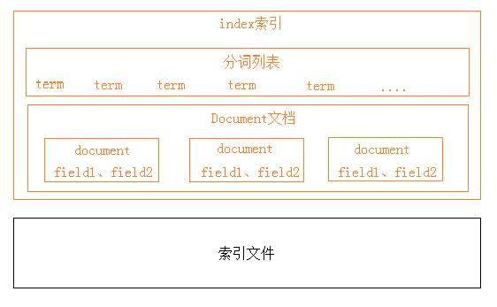
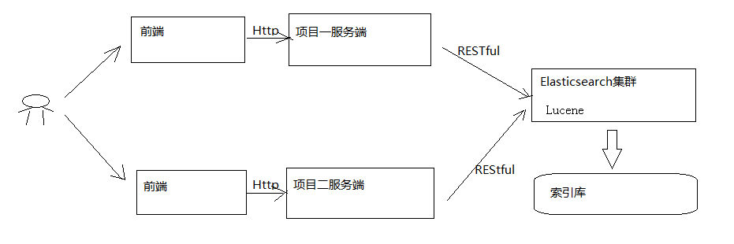

```
1.elasticsearch是一个基于Lucene的高扩展的分布式搜索服务器，支持开箱即用；隐藏了Lucene的复杂性，对外提供Restful接口来操作索引、搜索。
2.扩展性好，可部署上百台服务器集群，处理PB级数据；近实时的去索引数据、搜索数据。
3.es和solr选择：准备进行全文检索项目的开发，建议优先考虑elasticsearch，solr可以满足需求就不要换了
```




```
黑色部分是物理结构，上边黄色部分是逻辑结构；逻辑结构是为了描述ElasticSearch的工作原理及更好的使用物理结构中的索引文件；逻辑结构部分是一个倒排索引表：
	1、将要搜索的文档内容分词，所有不重复的词组成分词列表。
	2、将搜索的文档最终以Document方式存储起来。
	3、每个词和docment都有关联
搜索中提供相似性算法并以相关性排序结果
```



```
Elasticsearch提供 RESTful Api接口进行索引、搜索，并且支持多种客户端。
1）用户在前端搜索关键字
2）项目前端通过http方式请求项目服务端
3）项目服务端通过Http RESTful方式请求ES集群进行搜索
4）ES集群从索引库检索数据。
```

### ES快速入门

```
ES作为一个索引及搜索服务，对外提供丰富的REST接口，快速入门使用head插件来测试实例，对ES的使用方法及流程有个初步的认识。

```

创建索引库

```
ES的索引库是一个逻辑概念，它包括了分词列表及文档列表，同一个索引库中存储了相同类型的文档。它就相当于MySQL中的表，或相当于Mongodb中的集合。
关于索引这个语：
索引（名词）：ES是基于Lucene构建的一个搜索服务，它要从索引库搜索符合条件索引数据。
索引（动词）：索引库刚创建起来是空的，将数据添加到索引库的过程称为索引。
```

创建映射

```
在索引中每个文档都包括了一个或多个field，创建映射就是向索引库中创建field的过程，下边是document和field
与关系数据库的概念的类比：
文档（Document）----------------Row记录
字段（Field）-------------------Columns 列
注意：6.0之前的版本有type（类型）概念，type相当于关系数据库的表，ES官方将在ES9.0版本中彻底删除type。
上边讲的创建索引库相当于关系数据库中的数据库还是表？
1、如果相当于数据库就表示一个索引库可以创建很多不同类型的文档，这在ES中也是允许的。
2、如果相当于表就表示一个索引库只能存储相同类型的文档，ES官方建议在一个索引库中只存储相同类型的文档。
```

创建文档

```
ES中的文档相当于MySQL数据库表中的记录。
```

搜索文档

```

```

### IK分词器  

```
在添加文档时会进行分词，索引中存放的就是一个一个的词（term），当你去搜索时就是拿关键字去匹配词，最终找到词关联的文档。
```


### 映射

映射维护方法  

常用映射类型  


### 索引管理


### 搜索管理 


### 集群管理


### 相关资料

```
Elasticsearch: The Definitive Guide2，已停止更新
https://github.com/elastic/elasticsearch-definitive-guide
Elasticsearch 2.x : 权威指南
https://www.elastic.co/guide/cn/elasticsearch/guide/current/index.html
Elasticsearch Guide能查到最新版本资料
https://www.elastic.co/guide/en/elasticsearch/reference/current/elasticsearch-intro.html

Elasticsearch国内论坛
https://elasticsearch.cn/

```

