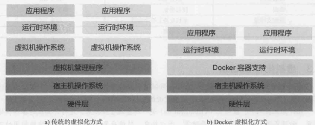

## docker与kubernetes

```
海马学院-从 Docker 到 Kubernetes 进阶 ，PDF ：Kubernetes-learning
```

教纲

```
Docker基础
	简介
	构建镜像与容器运行
	镜像基本操作
	私有镜像操作
	镜像组织结构
	镜像写时复制CopyOnWrite
数据共享与持久化
	数据卷，挂载，创建，备份，插件
Docker的三驾马车
	Compose，Machine，Swarm
Docker的网络
	网络模式，跨主机通信，网路选型
Docker的实践
	常用操作，DockerFile最佳实践，构建Web服务
Kubernetes基础
	简介，架构，组件介绍，概念术语
利用Kubeadm搭建集群环境
深入理解Pod
	定义创建，静态说明，生命周期，初始化，扩缩容，健康检查
常用对象操作
	ReplicationContainer，ReplicaSet，Deployment，等
数据共享与持久化存储
	Volume，PC/PVC 
服务发现
	内部服务发现，外部服务发现，Headless服务
包管理工具Helm
	Helm，HelmHook，模板
调度详解
	流程，策略，
Kubernetes集群监控
	
Kubernetes日志收集
	EFK方案
基于Kubernetes的CI/CD
	私有镜像仓库Harbor，GitLab Jenkins
```

Docker

```
搬运工，通过 Docker 将App 变成⼀种标准化的、 可移植的、 ⾃管理的组件， 我们可以在任何主流的操作系统中开发、 调试和运⾏
Docker和虚拟机最主要的区别：
	1.虚拟化技术依赖的是物理CPU和内存，是硬件级别的； Docker是构建在操作系统层⾯， 利⽤操作系统的容器化技术， 所以Docker同样的可以运⾏在虚拟机上⾯。
	2.虚拟机中的系统就是操作系统镜像，⽐较复杂； Docker⽐较轻量级， ⽤Docker部署⼀个独⽴的Redis， 就类似于在虚拟机当中安装⼀个 Redis 应⽤， 但是我们⽤Docker部署的应⽤是完全隔离的。
	3.传统的虚拟化技术是通过快照来保存状态的； Docker引⼊了类似于源码管理的机制， 将容器的快照历史版本⼀⼀记录下来， 切换成本⾮常之低。
	4.虚拟化技术在构建系统的时候⾮常复杂； ⽽ Docker 通过简单的 Dockerfile ⽂件来构建整个容器， 更重要的是Dockerfile可以⼿动编写， 可以通过发布Dockerfile 来定义应⽤的环境和依赖， 这样对于持续交付⾮常有利。
```



```

```

