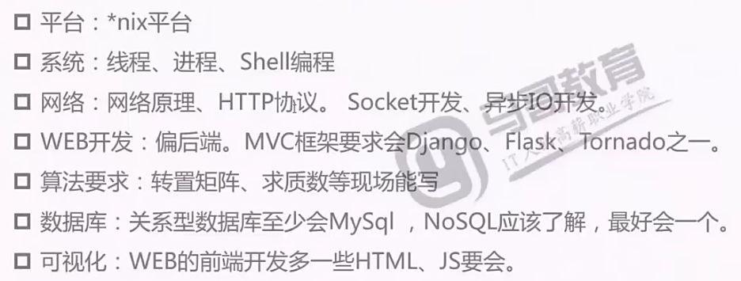

# Python学习

```
参考：马哥python全栈+爬虫+高端自动化课程大纲（2018版），开始日期：2018-03-17
```

要求：



```
课程内容：
职业方向：
	自动化运维工程师
	全栈工程师：WEB开发，前后端开发
	大数据开发工程师：Python语言完成，注重算法应用
	分析工程师：科学计算，数据建模，算法设计
	AI：算法框架PyTorch
学习目标：
	多写少问，先构思完成效果不苛求完美，查手册少看参考多总结实践，勤测试慎删除适当注释，通一门核心是逻辑，代码重构优化和复用，
```


## Python概述

版本的问题：不迷信版本，学会一个版本，好好学会一个语言，其他都不是问题

开发环境：Pyenv： 多版本管理工具


```


```

```


```

