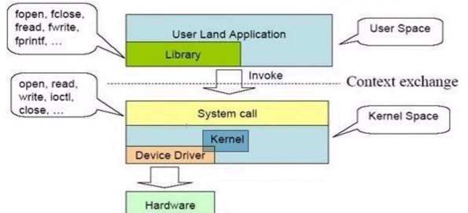
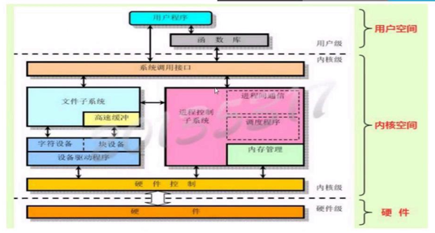
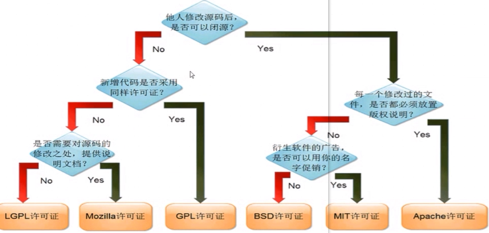
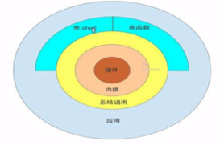
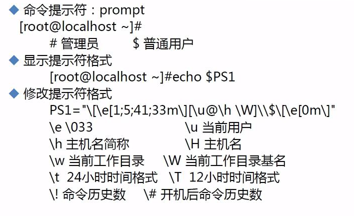
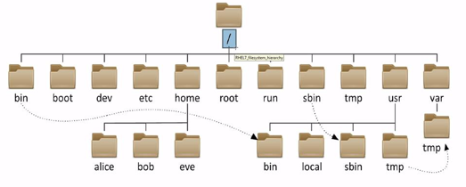

## 第一章

#### 操作系统OS

```
通用目的的软件程序: 用户-应用软件-操作系统-硬件
硬件驱动、进程管理、内存管理、网络管理、安全管理、文件管理
分类：
	服务器OS：RHEL，CentOS，WInServer，AIX
	桌面OS：Win10，Win7，MacOS，Fedora，Ubuntu
	移动设备OS：Andriod,ios,YunOS
```

##### 开发接口标准

```
ABI:Application Binary Interface
	应用程序与OS间的底层接口，允许编译好的目标代码在使用兼容ABI系统中无需改动就能运行
API:Application Programming Interface
	定义源代码与库间的接口，同样的源代码可以在支持这个API的任何系统中编译
POSIX:Portable Operating System Interface
	IEEE在操作系统上定义的一系列API标准
	POSIX兼容的程序可以在其它POSIX操作系统上编译执行
运行程序格式：
	Windows：EXE，DLL，Lib
	Linux：ELF，.so,.a
```

##### 库函数与系统调用

```
用户空间UserSpace，内核空间KernelSpace，上下文切换ContextExchange
```



###### UserSpace

```
用户程序的运行空间，为了安全它是隔离的即使崩溃，内核不受影响。
只能执行简单运算，不能直接调用系统资源，必须通过SystemCall，才能向内核发出指令
```

###### KernelSpace

```
Linux内核运行空间；可以执行任何命令调用系统的一切资源
```




#### Linux介绍

Linux内核版本号：主版本号+次版本号+末版本号+编译版本号+厂商版本

开源Opensource

```
开源：Opensource，软件和源代码提供给所有人
	自由分发软件和源代码
	能够修改和创建衍生作品
软件分类：商业，共享，自由free
```



Linux哲学思想

```
一切都是文件（包括硬件）
小型，单一用途的程序
链接程序，共同完成复杂的任务
避免令人困惑的用户界面
配置数据存储在文本中
```

获取Linux

虚拟机

Bash

简单命令

帮助用法

##### 终端

```
设备终端：键盘鼠标显示器
物理终端(/dev/console): 控制台console
虚拟终端(tty:teletypewriters,/dev/tty# #为[1-6]),tty可以有n个，Ctrl+ALt+F[1-6]
图形终端(dev/tty7)stratx,xwindows
  OS6：Ctrl+ALt+F7
  OS7：
串行终端(/dev/ttyS#)
伪终端(pty:pseudo-tty,/dev/pts/#) pty,SSH远程连接
查看当前终端:# tty
```

##### 交互式接口

```
启动终端后，在终端设备附加一个交互式应用程序
GUI：Graphic User Interface
	X protocol, windows manager,desktop
	Desktop:
		GNOME(C,图形库gtk)
		KDE(C++,图形库qt)
		XFCE(轻量级桌面)
CLI：Command Line Interface
	shell程序：sh bash
```

Shell

```
Linux系统的用户界面，提供用户与内核进行交互操作的一种接口。接收用户输入命令并把它送入内核去执行
shell为Linux的命令解释器
shell也是一种高级程序设计语言

```



命令提示符Prompt

```
可以用PS1来修改命令提示符
```



执行命令

```
输入命令后回车，提请shell找到键入命令所对应的可执行程序或代码，并又其分析后提交给内核分配资源运行起来
shell中有两类：
	内部命令：由shell自带，且通过某命令形式提供
		help 内部命令列表
		enable
	外部命令：在文件系统路径下有对应的可执行程序文件
		查看路径：which -a|--skip-alias         ；whereis，显示的更加详细，包括路径和文件
	区别指定的命令是内部还是外部：type COMMAND
	
```

时间

```

```

## 第二章 文件管理和重定向

```
文件系统结构元素，创建和查看文件，复制转移和删除文件，软和硬链接，三种I/O设备，把I/O重定向至文件，使用管道
```

#### 文件系统与目录结构




## 第三章 用户权限

```
Linux安全模型，解释用户账号和组群账号的目的，用户和组管理命令，理解并设置文件权限，默认和特殊权限，ACL
```

```
令牌token，identity
Linux用户：Username/UID
管理员：root ，0
普通用户：1-65535
	系统用户：1-499,1-999 ，对守护进程获取资源进行权限分配
	登录用户：500+，1000+，交互式登录
	
组group
	linux组：Group/GID
	管理员组：root，0
	普通组：
		系统组：1-499,1-999
		普通组：500+，1000+
安全上下文
	运行中的程序：进程process
	以进程发起者的身份运行：
		root：/bin/cat
		mage:/bin/cat
	进程所能够访问资源的权限取决于进程的运行者的身份
	
linux组的类别
	用户的主要组primary group：用户必须属于一个且只有一个主组；
		组名与用户名相同的，且仅包含一个用户，私有组
	用户的附加组supplementary group：一个用户可以属于零个或多个辅助组
	
用户和组的配置文件
	/etc/passwd:用户及其属性信息（名称，UID，主组ID等）
	/etc/group： 组及其属性信息
	/etc/shadow:用户密码及其相关属性
	/etc/gshadow:组密码及其相关属性

useradd 
```

```
用户创建
	useradd
	userdel mysqlname
	groupadd -g 666 mysqlname
	useradd -u 666 -g mysqlname mysqlname
	useradd -u 666 -r -s /sbin/nolgin -g mysqlname mysqlname
	useradd -G root,bin yang #主组与辅助组
	/etc/login.defs  #用户的useradd口令策略
	
	usermod -aG wang mage
	usermod -G "" mage
	
	userdel
```

