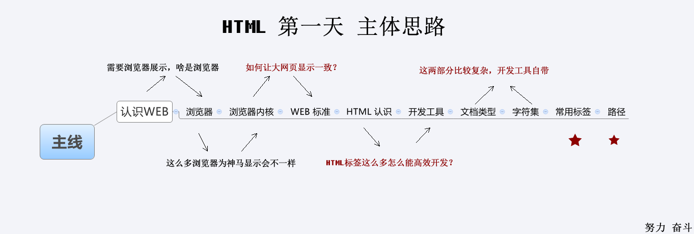
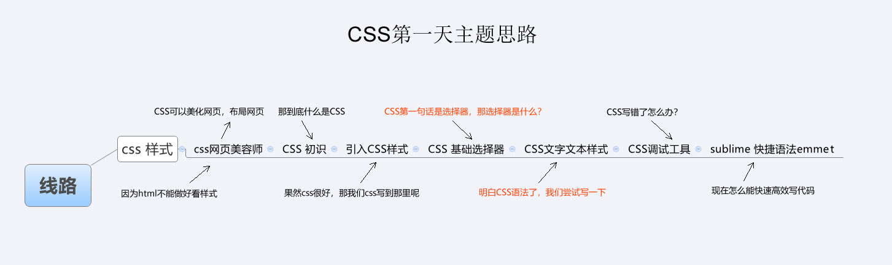
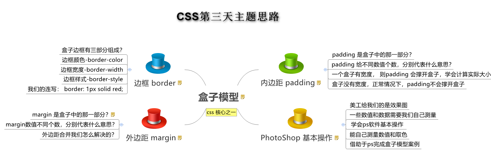
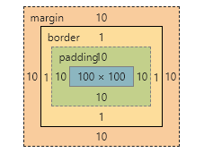

2019黑马新Web

# Html




### 浏览器内核

Rendering Engine，负责读取网页内容，整理讯息，计算网页的显示方式并显示页面.

| 浏览器    |      内核      | 备注                                                         |
| :-------- | :------------: | :----------------------------------------------------------- |
| IE        |    Trident     | IE、猎豹安全、360极速浏览器、百度浏览器                      |
| firefox   |     Gecko      | 可惜这几年已经没落了，打开速度慢、升级频繁、猪一样的队友flash、神一样的对手chrome。 |
| Safari/UC |     webkit     | 现在很多人错误地把 webkit 叫做 chrome内核（即使 chrome内核已经是 blink 了）。苹果感觉像被别人抢了媳妇，都哭晕再厕所里面了。 |
| chrome    | Chromium/Blink | 在 Chromium 项目中研发 Blink 渲染引擎（即浏览器核心），内置于 Chrome 浏览器之中。Blink 其实是 WebKit 的分支。大部分国产浏览器最新版都采用Blink内核。二次开发 |
| Opera     |     blink      | 现在跟随chrome用blink内核。                                  |

移动端的浏览器内核主要说的是系统内置浏览器的内核。

Android手机而言，使用率最高的就是Webkit内核，大部分国产浏览器宣称的自己的内核，基本上也是属于webkit二次开发。

iOS以及WP7平台上，由于系统原因，系统大部分自带浏览器内核，一般是Safari或者IE内核Trident的

浏览器内核包括两部分，渲染引擎和js引擎。渲染引擎负责读取网页内容，整理讯息，计算网页的显示方式并显示页面，js引擎是解析执行js获取网页的动态效果。 后来 JS 引擎越来越独立，内核就倾向于只指渲染引擎。

### Web 标准

主要包括结构（Structure）、表现（Presentation）和行为（Behavior）三个方面。

| 标准 |   说明   | 内容 | 与人对应         |
| :--: | :------: | :--: | ---------------- |
| 结构 | 网页元素 | html | 人天然的身体骨架 |
| 表现 | 外观样式 | css  | 人衣品着装打扮   |
| 行为 | 交互定义 |  Js  | 人行为语言素质   |

好处：让Web的发展前景更广阔 ，内容能被更广泛的设备访问，更容易被搜寻引擎搜索，降低网站流量费用，使网站更易于维护，提高页面浏览速度


# CSS




目标：结构(html)与样式(css)相分离

作用：设置页面版面的布局和外观显示样式

### 引入CSS样式表

行内式：style属性标签设置，任何HTML标签都拥有style属性，用来设置行内式。

内嵌样式表：head头部标签中，并且用style标签定义

```css
<style type="text/CSS">
</style>
```

外链样式:是将所有的样式放在一个或多个以.CSS为扩展名的外部样式表文件中，通过link标签将外部样式表文件链接到HTML文档中

```html
<head>
  <link rel="stylesheet" type="text/css" href="css文件路径">
</head>
```

### 约定-代码风格

紧凑格式 (Compact)

展开格式（推荐）

```css
h3 {
	  color: deeppink;
    font-size: 20px;    
}
```

代码大小写:样式选择器，属性名，属性值关键字全部使用小写字母书写，属性字符串允许使用大小写。

### 选择器

作用：找到特定的HTML页面元素

#### 基础选择器

| 基础选择器   | 作用                      | 缺点                     | 使用情况   | 用法                 |
| ------------ | ------------------------- | ------------------------ | ---------- | -------------------- |
| 标签选择器   | 选出所有相同的标签，比如p | 不能差异化选择           | 较多       | p { color：red;}     |
| 类选择器     | 可以选出1个或者多个标签   | 可以根据需求选择         | 非常多     | .nav { color: red; } |
| id选择器     | 一次只能选择器1个标签     | 只能使用一次             | 不推荐使用 | #nav {color: red;}   |
| 通配符选择器 | 选择所有的标签            | 选择的太多，有部分不需要 | 不推荐使用 | * {color: red;}      |

尽量少用ID和通配符选择器，不使用无具体语义定义的标签选择器 div span 

#### 复合选择器

作用：选择更准确更精细的目标元素标签

| 选择器         | 作用                     | 特征                       | 使用情况 | 隔开符号及用法                          |
| -------------- | ------------------------ | -------------------------- | -------- | --------------------------------------- |
| 后代选择器     | 用来选择元素后代         | 是选择所有的子孙后代，包含 | 较多     | 符号是**空格** .nav a                   |
| 子代选择器     | 选择最近一级元素         | 只选亲儿子，位置精确       | 较少     | 符号是**>**   .nav>p                    |
| 交集选择器     | 选择两个标签交集的部分   | 既是 又是                  | 较少     | **没有符号，中间没有空格**  p.one       |
| 并集选择器     | 选择某些相同样式的选择器 | 可以用于集体声明           | 较多     | 符号是**逗号** .nav, .header            |
| 链接伪类选择器 | 给链接更改状态           |                            | 较多     | 重点记住 a{} 和 a:hover  实际开发的写法 |


### 字体样式

| 属性        | 表示     | 注意点                                                       |
| :---------- | :------- | :----------------------------------------------------------- |
| font-size   | 字号     | 我们通常用的单位是px 像素，一定要跟上单位                    |
| font-family | 字体     | 实际工作中按照团队约定来写字体                               |
| font-weight | 字体粗细 | 记住加粗是 700 或者 bold  不加粗 是 normal 或者  400  记住数字不要跟单位 |
| font-style  | 字体样式 | 记住倾斜是 italic     不倾斜 是 normal  工作中我们最常用 normal |
| font        | 字体连写 | 1. 字体连写是有顺序的  不能随意换位置     2. 其中字号 和 字体 必须同时出现 |

### 字体外观属性

| 属性            | 表示     | 注意点                                                  |
| :-------------- | :------- | :------------------------------------------------------ |
| color           | 颜色     | 我们通常用  十六进制   比如 而且是简写形式 #fff         |
| line-height     | 行高     | 控制行与行之间的距离                                    |
| text-align      | 水平对齐 | 可以设定文字水平的对齐方式                              |
| text-indent     | 首行缩进 | 通常我们用于段落首行缩进2个字的距离   text-indent: 2em; |
| text-decoration | 文本修饰 | 记住 添加 下划线  underline  取消下划线  none           |

### 标签显示模式

Html标签的类型：块标签和行内标签

- 块级元素block的特点

  自己独占一行；高度，宽度、内外边距均可以控制；宽度默认是容器（父级宽度）的100%；是一个容器盒子，里面可以放行内或者块级元素。

  常见的块元素有<h1>~<h6>、<p>、<div>、<ul>、<ol>、<li>等，其中<div>标签是最典型的块元素。文字类块级标签里面就不要再放块级元素

- 行内元素inline的特点：

  相邻行内元素在一行上，一行可以显示多个；高、宽直接设置是无效的；默认宽度就是它本身内容的宽度；**行内元素只能容纳文本或则其他行内元素。**

  常见的行内元素有<a>、<strong>、<b>、<em>、<i>、<del>、<s>、<ins>、<u>、<span>等，其中<span>标签最典型的行内元素。有的地方也成内联元素

- 行内块元素inline-block的特点

  和相邻行内元素（行内块）在一行上,但是之间会有空白缝隙，一行可以显示多个；默认宽度就是它本身内容的宽度；高度，行高、外边距以及内边距都可以控制。

  、<input />、<td>，可以对它们设置宽高和对齐属性

| 元素模式   | 元素排列               | 设置样式               | 默认宽度         | 包含                     |
| ---------- | ---------------------- | ---------------------- | ---------------- | ------------------------ |
| 块级元素   | 一行只能放一个块级元素 | 可以设置宽度高度       | 容器的100%       | 容器级可以包含任何标签   |
| 行内元素   | 一行可以放多个行内元素 | 不可以直接设置宽度高度 | 它本身内容的宽度 | 容纳文本或则其他行内元素 |
| 行内块元素 | 一行放多个行内块元素   | 可以设置宽度和高度     | 它本身内容的宽度 |                          |

### 行高line-height

4条线：顶线，中线，基线，底线；行高为2条基线之间的距离

单行文本在盒子中垂直居中对齐：**文字的行高等于盒子的高度**。

行高   =  上距离 +  内容高度  + 下距离 ，行高 >高度   文字偏下 ；行高<高度   文字偏上 

### 背景Background

| 属性                  | 作用             | 值                                                           |
| --------------------- | :--------------- | :----------------------------------------------------------- |
| background-color      | 背景颜色         | 预定义的颜色值/十六进制/RGB代码                              |
| background-image      | 背景图片         | url(图片路径)                                                |
| background-repeat     | 是否平铺         | repeat/no-repeat/repeat-x/repeat-y                           |
| background-position   | 背景位置         | length/position    分别是x  和 y坐标， 切记 如果有 精确数值单位，则必须按照先X 后Y 的写法 |
| background-attachment | 背景固定还是滚动 | scroll/fixed                                                 |
| 背景简写              | 更简单           | 背景颜色 背景图片地址 背景平铺 背景滚动 背景位置;  他们没有顺序 |
| 背景透明              | 让盒子半透明     | background: rgba(0,0,0,0.3);   后面必须是 4个值              |

### 3大特性

层叠性：样式冲突，遵循的原则是**就近原则。** 哪一个样式离着结构近，就执行那个样式。不冲突的标签，不会层叠

继承性：子标签会继承父标签的某些样式；设置一个可继承的属性，只需将它应用于父元素即可

​        子元素可以继承父元素的样式（**text-，font-，line-这些元素开头的可以继承，以及color属性**）

优先级：选择器相同，层叠性；不同，则优先级计算；权重叠加无进位计算

| 标签选择器             | 计算权重公式 |
| ---------------------- | ------------ |
| 继承或者 *             | 0,0,0,0      |
| 每个元素（标签选择器） | 0,0,0,1      |
| 每个类，伪类           | 0,0,1,0      |
| 每个ID                 | 0,1,0,0      |
| 每个行内样式 style=""  | 1,0,0,0      |
| 每个!important  重要的 | ∞ 无穷大     |

## 盒子模型




就是盛装内容的容器，由HTML页面元素内容、边框（border）、内边距（padding）、和外边距（margin）组成




### 边框border

| 属性         |                  作用                  |
| ------------ | :------------------------------------: |
| border-width |         定义边框粗细，单位是px         |
| border-style | 边框的样式none，solid，dotted,  dashed |
| border-color |                边框颜色                |

```css
 border: 1px solid red;  //没有顺序 ,简写 
```

```css
//表格合并相邻的边框，防止出现边框变粗
table, td {
		border-collapse: collapse;  /*合并相邻边框*/
	}
```

### 内边距padding

 边框与内容之间的距离

给盒子指定padding值之后， 发生了2件事情：

1. 内容和边框 有了距离，添加了内边距。
2. 盒子会变大了。

内盒尺寸计算（元素实际大小）

Element Height = content height + padding + border （Height为内容高度）

Element Width = content width + padding + border （Width为内容宽度）

盒子的实际的大小 =   内容的宽度和高度 +  内边距   +  边框   

设置 内边距会撑大原来的盒子，但是可以通过设置宽高，减去内边距值来维持原来的大小

如果没有给盒子制定高宽度，此时指定Padding  ,则不会撑大盒子

**注意**：要学会计算盒子大小

### 外边距margin

主要控制盒子与盒子之间的距离

块级盒子水平居中必须：盒子须指定宽度，左右外边距 设置为auto

`.header{ width:960px; margin:0 auto;}`

盒子内的文字水平居中是  text-align: center,  而且还可以让 行内元素和行内块居中对齐

清除元素默认内外边距 

```
* {
   padding:0;         /* 清除内边距 */
   margin:0;          /* 清除外边距 */
}
```

行内元素为了照顾兼容性， 尽量只设置左右内外边距， 不要设置上下内外边距。

##### 外边距合并问题

相邻块元素垂直外边距的合并：上下相邻的块元素，上有margin-bottom，下有margin-top，则取这2者间的较大值，而不是2者之和，称为外边距塌陷

---解决方法：尽量给只给一个盒子添加margin值。

##### 嵌套块元素垂直外边距的合并

两个嵌套关系的块元素，如果父元素没有上内边距及边框，父元素的margin-top会与子元素的margin-top合并，值为两者中的较大值

---解决方法：父元素定义上边框或者内边距，verflow:hidden。

#### 布局稳定性

建议使用的优先顺序：  width >  padding  >   margin  

为达到浏览器的兼容性，去掉列表默认样式：li { list-style: none; }

## 浮动

### CSS布局的三种机制

布局的核心——就是**用 CSS 来摆放盒子**。

1.普通流

- **块级元素**会独占一行，**从上向下**顺序排列；
  - 常用元素：div、hr、p、h1~h6、ul、ol、dl、form、table
- **行内元素**会按照顺序，**从左到右**顺序排列，碰到父元素边缘则自动换行；
  - 常用元素：span、a、i、em等

2.浮动

​         让盒子从普通流中**浮**起来,主要作用让多个块级盒子一行显示

3.定位

​           将盒子**定**在浏览器的某一个**位**置——CSS 离不开定位，特别是后面的 js 特效

### 浮动介绍

设置了浮动属性的元素脱离标准普通流的控制，能移动到指定位置

作用：

1. 多个盒子水平排列成行
2. 实现盒子的左右对齐
3. 控制图片，实现文字环绕图片的效果

语法：

​       选择器 { float: 属性值; } none，left ,right

特点: **浮漏特**

| 特点 | 说明                                                         |
| ---- | ------------------------------------------------------------ |
| 浮   | 加了浮动的盒子**是浮起来**的，漂浮在其他标准流盒子的上面。   |
| 漏   | 加了浮动的盒子**是不占位置的**，它原来的位置**漏给了标准流的盒子**。 |
| 特   | 任何元素都可浮动，浮动元素会改变display属性， 类似转为了行内块，但元素间没有空白缝隙 |

**注意： 浮动的元素互相贴靠一起的，但是如果父级宽度装不下这些浮动的盒子， 多出的盒子会另起一行对齐**

### 浮动应用

浮动和标准流的父盒子搭配

“一个完整的网页，是 标准流 +  浮动 +  定位 一起完成的。”

##### 浮动元素与父盒子的关系

- 子盒子的浮动参照父盒子对齐
- 不会与父盒子的边框重叠，也不会超过父盒子的内边距

##### 浮动元素与兄弟盒子的关系

在一个父级盒子中，如果**前一个兄弟盒子**是：

- **浮动**的，那么**当前盒子**会与前一个盒子的顶部对齐；
- **普通流**的，那么**当前盒子**会显示在前一个兄弟盒子的下方。 

“浮动只会影响当前的或者是后面的标准流盒子，不会影响前面的标准流。”

**如果一个盒子里面有多个子盒子，如果其中一个盒子浮动了，其他兄弟也应该浮动。防止引起问题**

### 清除浮动

子盒子浮动就不占有原文档流的位置，而正常标准流能够撑开父盒子高度

**本质：清除浮动主要为了解决父级元素因为子级浮动引起内部高度为0 的问题。清除浮动之后， 父级就会根据浮动的子盒子自动检测高度。父级有了高度，就不会影响下面的标准流了**

##### 方法

 语法： clear: both;

###### 1.额外标签法(隔墙法)

```html
是W3C推荐的做法是通过在浮动元素末尾添加一个空的标签例如 <div style=”clear:both”></div>，或则其他标签br等亦可。
```

- 优点： 通俗易懂，书写方便
- 缺点： 添加许多无意义的标签，结构化较差。

###### 2.父级添加overflow属性方法

```css
可以给父级添加： overflow为 hidden| auto| scroll  都可以实现。
```

优点：  代码简洁

缺点：  内容增多时候容易造成不会自动换行导致内容被隐藏掉，无法显示需要溢出的元素。

###### 3).使用after伪元素清除浮动

**:after 方式为空元素额外标签法的升级版，好处是不用单独加标签了** 

使用方法：

```css
 .clearfix:after {  content: ""; display: block; height: 0; clear: both; visibility: hidden;  }   

 .clearfix {*zoom: 1;}   /* IE6、7 专有 */
```

- 优点： 符合闭合浮动思想  结构语义化正确
- 缺点： 由于IE6-7不支持:after，使用 zoom:1触发 hasLayout。
- 代表网站： 百度、淘宝网、网易等

###### 4).使用双伪元素清除浮动

使用方法：

```css
.clearfix:before,.clearfix:after { 
  content:"";
  display:table; 
}
.clearfix:after {
 clear:both;
}
.clearfix {
  *zoom:1;
}
```

- 优点：  代码更简洁

- 缺点：  由于IE6-7不支持:after，使用 zoom:1触发 hasLayout。

- 代表网站： 小米、腾讯等

**什么时候用清除浮动呢？**

1. 父级没高度
2. 子盒子浮动了
3. 影响下面布局了，我们就应该清除浮动了。

## 定位

“将盒子**定**在某一个**位**置  自由的漂浮在其他盒子(包括标准流和浮动)的上面 ”

三种布局机制的上下顺序

标准流在最底层 (海底)  -------    浮动 的盒子 在 中间层  (海面)  -------   定位的盒子 在 最上层  （天空）

### 定位介绍

两部分组成：`定位 = 定位模式 + 边偏移`

### 偏位移

定位的盒子，是通过边偏移来移动位置的，通过 `top`、`bottom`、`left` 和 `right` 属性定义元素的**边偏移**

| 边偏移属性 | 示例           | 描述                                                     |
| ---------- | :------------- | -------------------------------------------------------- |
| `top`      | `top: 80px`    | **顶端**偏移量，定义元素相对于其父元素**上边线的距离**。 |
| `bottom`   | `bottom: 80px` | **底部**偏移量，定义元素相对于其父元素**下边线的距离**。 |
| `left`     | `left: 80px`   | **左侧**偏移量，定义元素相对于其父元素**左边线的距离**。 |
| `right`    | `right: 80px`  | **右侧**偏移量，定义元素相对于其父元素**右边线的距离**   |

### 定位模式

选择器 { position: 属性值; }

| 值         |     语义     |
| ---------- | :----------: |
| `static`   | **静态**定位 |
| `relative` | **相对**定位 |
| `absolute` | **绝对**定位 |
| `fixed`    | **固定**定位 |


#### 静态定位static

是元素的默认定位方式，无定位的意思；按照标准流特性摆放位置，它没有边偏移；布局时几乎不用的 。

#### 相对定位relative

是元素**相对**于它原来在标准流中的位置来说的。

特点：（务必记住）

- 相对于 自己原来在标准流中位置来移动的
- 原来**在标准流的区域继续占有**，后面的盒子仍然以标准流的方式对待它。

#### 绝对定位absolute - 重要  

是元素以带有定位的父级元素来移动位置 ，因为绝对定位的盒子是拼爹的，所以要和父级搭配一起来使用。

1. **完全脱标** —— 完全不占位置；  
2. **父元素没有定位**，则以**浏览器**为准定位（Document 文档）。
3. **父元素要有定位** ，将元素依据最近的已经定位（绝对、固定或相对定位）的父元素（祖先）进行定位。

特点：（务必记住）

- 绝对是以带有定位的父级元素来移动位置 （拼爹型） 如果父级都没有定位，则以浏览器文档为准移动位置
- 不保留原来的位置，完全是脱标的。

##### 定位口诀 —— 子绝父相

绝对定位要和带有定位的父级搭配使用，那么父级要用什么定位呢？

**子绝父相** —— **子级**是**绝对**定位，**父级**要用**相对**定位。

> **子绝父相**是使用绝对定位的口诀，要牢牢记住！
>
> **结论**：**父级要占有位置，子级要任意摆放**，这就是**子绝父相**的由来。

#### 固定定位fixed - 重要

是**绝对定位**的一种特殊形式

1. **完全脱标** —— 完全不占位置；
2. 只认**浏览器的可视窗口** —— `浏览器可视窗口 + 边偏移属性` 来设置元素的位置；
   * 跟父元素没有任何关系；单独使用的
   * 不随滚动条滚动

应用场景：

1. **固定定位**的应用场景：**固定在浏览器可视窗口某个位置的布局**；
2. 在使用固定和绝对定位时，如果盒子中没有内容，需要指定宽度

### 定位扩展

盒子居中

堆叠顺序（z-index）

定位改变display属性

#### 定位小结

| 定位模式         | 是否脱标占有位置     | 移动位置基准           | 模式转换（行内块） | 使用情况                 |
| ---------------- | -------------------- | :--------------------- | ------------------ | ------------------------ |
| 静态static       | 不脱标，正常模式     | 正常模式               | 不能               | 几乎不用                 |
| 相对定位relative | 不脱标，占有位置     | 相对自身位置移动       | 不能               | 基本单独使用             |
| 绝对定位absolute | 完全脱标，不占有位置 | 相对于定位父级移动位置 | 能                 | 要和定位父级元素搭配使用 |
| 固定定位fixed    | 完全脱标，不占有位置 | 相对于浏览器移动位置   | 能                 | 单独使用，不需要父级     |


## CSS高级技巧

### 元素的显示与隐藏

#### 1.display 显示

display 设置或检索对象是否及如何显示；隐藏之后，不再保留位置。

display: none 隐藏对象

display：block 除了转换为块级元素之外，同时还有显示元素的意思。

#### 2.visibility 可见性

设置或检索是否显示对象；隐藏之后，继续保留原有位置.

visibility：visible ; 　对象可视

visibility：hidden; 　  对象隐藏

#### 3.overflow 溢出

检索或设置当对象的内容超过其指定高度及宽度时如何管理内容。

| 属性值      | 描述                                       |
| ----------- | ------------------------------------------ |
| **visible** | 不剪切内容也不添加滚动条                   |
| **hidden**  | 不显示超过对象尺寸的内容，超出的部分隐藏掉 |
| **scroll**  | 不管超出内容否，总是显示滚动条             |
| **auto**    | 超出自动显示滚动条，不超出不显示滚动条     |

#### 4.总结

| 属性           | 区别                   | 用途                                                         |
| -------------- | ---------------------- | ------------------------------------------------------------ |
| **display**    | 隐藏对象，不保留位置   | 配合后面js做特效，比如下拉菜单，原先没有，鼠标经过，显示下拉菜单， 应用极为广泛 |
| **visibility** | 隐藏对象，保留位置     | 使用较少                                                     |
| **overflow**   | 只是隐藏超出大小的部分 | 1. 可以清除浮动 2. 保证盒子里面的内容不会超出该盒子范围      |

### CSS用户界面样式

| 属性         | 用途                 | 用途                                                         |
| ------------ | -------------------- | ------------------------------------------------------------ |
| **鼠标样式** | 更改鼠标样式cursor   | 样式很多，重点记住 pointer                                   |
| **轮廓线**   | 表单默认outline      | outline 轮廓线，我们一般直接去掉，border是边框，我们会经常用 |
| 防止拖拽     | 主要针对文本域resize | 防止用户随意拖拽文本域，造成页面布局混乱，我们resize:none    |

#### vertical-align 垂直对齐

- 有宽度的块级元素居中对齐，是margin: 0 auto;
- 让文字居中对齐，是 text-align: center;

vertical-align 垂直对齐，它只针对于**行内元素**或者**行内块元素**，**通常用来控制图片/表单与文字的对齐**。

vertical-align : baseline |top |middle |bottom 

#### 图片、表单和文字对齐

以通过vertical-align 控制图片和文字的垂直关系了。 默认的图片会和文字基线对齐。

#### 去除图片底侧空白缝隙

原因：

图片或者表单等行内块元素，他的底线会和父级盒子的基线对齐。

就是图片底侧会有一个空白缝隙。

解决方法：

给img vertical-align:middle | top| bottom等等。  让图片不要和基线对齐。

给img 添加 display：block; 转换为块级元素就不会存在问题了。

#### 溢出的文字省略号显示

```
  /*1. 先强制一行内显示文本*/
      white-space: nowrap;
  /*2. 超出的部分隐藏*/
      overflow: hidden;
  /*3. 文字用省略号替代超出的部分*/
      text-overflow: ellipsis;
```

### CSS精灵技术（sprite) 重点

**为了有效地减少服务器接受和发送请求的次数，提高页面的加载速度。**

css精灵技术主要针对于背景图片，插入的图片img 是不需要这个技术的。

1. 精确测量，每个小背景图片的大小和 位置。
2. 给盒子指定小背景图片时， 背景定位基本都是 负值。


# 移动WEB


## 流式布局

### 移动端基础

#### 浏览器

 PC端常见浏览器：360浏览器、谷歌浏览器、火狐浏览器、QQ浏览器、百度浏览器、搜狗浏览器、IE浏览器。

移动端常见浏览器：UC浏览器，QQ浏览器，欧朋浏览器，百度手机浏览器，360安全浏览器，谷歌浏览器，搜狗手机浏览器，猎豹浏览器，以及其他杂牌浏览器。

国内的UC和QQ，百度等手机浏览器都是根据Webkit修改过来的内核，国内尚无自主研发的内核，就像国内的手机操作系统都是基于Android修改开发的一样。

**总结：兼容移动端主流浏览器，处理Webkit内核浏览器即可。**

#### 手机屏幕

作为开发者无需关注这些分辨率，因为我们常用的尺寸单位是 px

数据参考https://material.io/devices/ 。
        注：作为前端开发，不建议大家去纠结dp， dpi， pt， ppi等单位。  

#### 移动端调试方法

+ Chrome DevTools（谷歌浏览器）的模拟手机调试
+ 搭建本地web服务器，手机和服务器一个局域网内，通过手机访问服务器
+ 使用外网服务器，直接IP或域名访问

### 视口

视口（viewport）就是浏览器显示页面内容的屏幕区域。 视口可以分为布局视口、视觉视口和理想视口

布局视口 layout viewport

视觉视口 visual viewport

#### 理想视口 ideal viewport

为了使网站在移动端有最理想的浏览和阅读宽度而设定

理想视口，对设备来讲，是最理想的视口尺寸

需要手动添写meta视口标签通知浏览器操作

meta视口标签的主要目的：布局视口的宽度应该与理想视口的宽度一致，简单理解就是设备有多宽，我们布局的视口就多宽

**总结：我们开发最终会用理想视口，而理想视口就是将布局视口的宽度修改为视觉视口**

#### meta标签


最标准的viewport设置

+ 视口宽度和设备保持一致
+ 视口的默认缩放比例1.0
+ 不允许用户自行缩放
+ 最大允许的缩放比例1.0
+ 最小允许的缩放比例1.0

### 二倍图

物理像素&物理像素比：

物理像素点指的是屏幕显示的最小颗粒，是物理真实存在的。这是厂商在出厂时就设置好了,比如苹果6 是  750* 1334

我们开发时候的1px 不是一定等于1个物理像素的

一个px的能显示的物理像素点的个数，称为物理像素比或屏幕像素比

如果把1张100*100的图片放到手机里面会按照物理像素比给我们缩放

lRetina（视网膜屏幕）是一种显示技术，可以将把更多的物理像素点压缩至一块屏幕里，从而达到更高的分辨率，并提高屏幕显示的细腻程度。

对于一张 50px * 50px 的图片,在手机或 Retina 屏中打开，按照刚才的物理像素比会放大倍数，这样会造成图片模糊

在标准的viewport设置中，使用倍图来提高图片质量，解决在高清设备中的模糊问题

通常使用二倍图， 因为iPhone 6 的影响背景图片 注意缩放问题

#### 背景缩放

background-size属性规定背景图像的尺寸

```
background-size: 背景图片宽度 背景图片高度;
```

单位： 长度|百分比|cover|contain;

cover把背景图像扩展至足够大，以使背景图像完全覆盖背景区域。

contain把图像图像扩展至最大尺寸，以使其宽度和高度完全适应内容区域

### 移动开发选择和技术方案

#### 移动端主流方案

1.单独制作移动端页面（主流）

通常情况下，网址域名前面加 m(mobile)可打开移动端。通过判断设备，如果是移动设备打开，则跳到移动端页面。  

也就是说，PC端和移动端为两套网站，pc端是pc断的样式，移动端在写一套，专门针对移动端适配的一套网站

2.响应式页面兼容移动端（其次）

响应式网站：即pc和移动端共用一套网站，只不过在不同屏幕下，样式会自动适配

#### 移动端技术解决方案

1.移动端浏览器兼容问题

移动端浏览器基本以 webkit 内核为主，因此我们就考虑webkit兼容性问题。

可以放心使用 H5 标签和 CSS3 样式。

我们浏览器的私有前缀我们只需要考虑添加 webkit 即可

2.移动端公共样式

移动端 CSS 初始化推荐使用 normalize.css/

Normalize.css：保护了有价值的默认值

Normalize.css：修复了浏览器的bug

Normalize.css：是模块化的

Normalize.css：拥有详细的文档

#### CSS3盒子模型box-sizin

传统模式宽度计算：盒子的宽度 = CSS中设置的width + border + padding 

CSS3盒子模型：     盒子的宽度=  CSS中设置的宽度width 里面包含了 border 和 padding 

也就是说，我们的CSS3中的盒子模型， padding 和 border 不会撑大盒子了

```
/*CSS3盒子模型*/
box-sizing: border-box;
/*传统盒子模型*/
box-sizing: content-box;

```

移动端可以全部CSS3 盒子模型

PC端如果完全需要兼容，我们就用传统模式，如果不考虑兼容性，我们就选择 CSS3 盒子模型

#### 移动端特殊样式

    /*CSS3盒子模型*/
    box-sizing: border-box;
    -webkit-box-sizing: border-box;
    /*点击高亮我们需要清除清除  设置为transparent 完成透明*/
    -webkit-tap-highlight-color: transparent;
    /*在移动端浏览器默认的外观在iOS上加上这个属性才能给按钮和输入框自定义样式*/
    -webkit-appearance: none;
    /*禁用长按页面时的弹出菜单*/
    img,a { -webkit-touch-callout: none; }
### 移动端常见布局

移动端单独制作

+ 流式布局（百分比布局）
+ flex 弹性布局（强烈推荐）
+ less+rem+媒体查询布局
+ 混合布局

响应式

+ 媒体查询
+ bootstarp

流式布局：

流式布局，就是百分比布局，也称非固定像素布局。

通过盒子的宽度设置成百分比来根据屏幕的宽度来进行伸缩，不受固定像素的限制，内容向两侧填充。

流式布局方式是移动web开发使用的比较常见的布局方式。