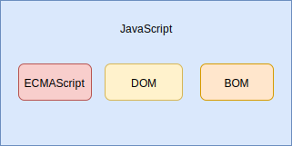
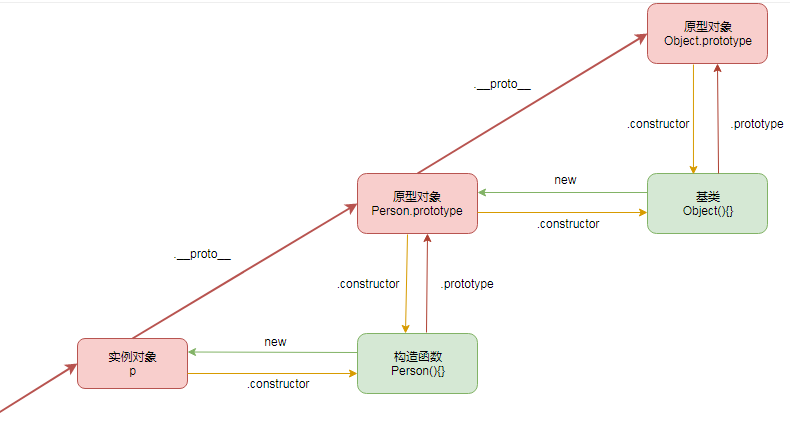

## 1.JavaScript简介

### 1.1历史

95 年诞生，统一标准ECMAScript，历史：3，4,  5 ，6 ，ES2016，ES2016 最出色的地方是引入了`async await`异步解决方案。

### 1.2组成

ECMAScript 是 JavaScript 的语法核心，浏览器环境两大对象 DOM、BOM



 JavaScript 包含三个方面：

-   ECMAScript：JavaScript 语法标准，如：类型、关键字、基本对象等，有 ES5、ES6(即 ES2015)、ES7(即 ES2016)，后续皆以年代为规范的名称
-   DOM：`Document Object Model`，JavaScript 操作网页元素的 API
-   BOM：`Browser Object Model`，JavaScript 操作浏览器部分功能的 API

### 1.3引擎

JavaScript 是一种解释性编程语言，依赖于解释引擎

-   v8 引擎：js 最著名的引擎，以高性能著称，被应用于 Chrome 浏览器与 Node.js
-   SpiderMonkey：火狐浏览器中的 js 引擎

| 运行时名称     | 内置 JS 引擎        | 内置排版引擎     | 内置 API              |
| -------------- | ------------------- | ---------------- | --------------------- |
| Chrome 浏览器  | V8                  | Webkit->Blink    | DOM、BOM 等 HTML API  |
| FireFox 浏览器 | Monkey 系列         | Gecko            | DOM、BOM 等 HTML API  |
| IE 浏览器      | Jscript->Chakra(9+) | Trident          | DOM、BOM 等 HTML API  |
| Safari 浏览器  | Nitro               | Webkit           | DOM、BOM 等 HTML API  |
| Edg 浏览器     | Chakra              | EdgeHTML->Webkit | DOM、BOM 等 HTML API  |
| Node.js        | V8                  | 无               | 网络、文件等 系统 API |

### 1.4书写规范

区分大小写！

注释：多行注释中每行开头都有一个星号是推荐的写法，每行开头的星号是可以省略的，但是不推荐！

```js
//  单行注释

/*
 *   多行注释
 *   多行注释
 *   多行注释
 */
```

js 语句末尾的分号可以写也可以不写，不写的时候要保证每行代码都具备完整的语义！

## 2.标识符

-   只能以`字母`、`_`、`$`三种形式开头
-   其他字符可以是`字母`、`数字`、`_`、`$`
-   不能是关键字、保留字

ECMAScript 标识符一般采用驼峰写法，即首字母小写，剩下每个单词首字母大写，如：`myCar`、`doSomething`

### 2.1变量

在 JS 中，变量可以保存任何类型的数据，每个变量仅仅是一个保存任意值的占位符。JS 中声明一个变量有三种方式：

-   `var`：ES5 及其之前规范
-   `let`：ES6 规范
-   `const`：ES6 规范，用来声明一个不可变变量。

```js
// 单个变量定义并初始化
var i = 3

// 多个变量定义并初始化
var a = 3,
    b = 4

// 单个变量定义
var num // 此时其值是 undefined
num = 3

// 多个变量定义
var num1, num2
num1 = 4
num2 = 6

let num3 = 1
console.log(num3) // 1
num3 = 11
console.log(num3) // 11

const num4 = 2
console.log(num4) // 2
num4 = 22 // 报错：const定义的数据无法再更改
console.log(num4)

```

对于引用类型的数据，const 只是不会改变引用地址，具体的引用数据是可以改变的

同一个作用域内不能重复声明

```js
var num = 10
var num = 100 // 不会报错，而let/const这里报错
const a = []
a.push(1) // 改变a是可以的
```

## 3.数据类型

**基本类型**：值类型或者原始类型（primitive type）

-   数据更改：基本类型创建后即不可更改原有数据，比如字符串在更改时其实是内部进行字符串拷贝后返回的一个全新的字符串
-   存储位置：由于数据大小确定，基本类型的数据占据空间一般也较小，所以基本类型在内存中存储于`栈区`
-   数据访问：基本类型数据由于栈中，可以按值存放，按值访问！
-   数据拷贝：是将栈中的一个值本身复制给了另外一个值
-   生命周期：栈中的数据随着方法的结束就会销毁

**引用类型**：也即对象类型（object type），值可以修改（注意：修改的其实是对象的引用，而不是真实的数据被修改！），一般使用`new`创建的数据都是引用类型

-   数据更改：通过修改对象引用的指向来修改数据
-   存储位置：因为其数据大小不确定，需要保存在运行时数据区，所以引用类型在内存中存储于`堆区`
-   数据访问：通过类指针的方式进行访问
-   数据拷贝：引用类型的数据拷贝，是拷贝该数据的引用指针
-   生命周期：堆内存中的对象不会随方法的结束而销毁，即使方法结束后，这个对象还可能被另一个引用变量所引用（方法的参数传递时很常见），则这个对象依然不会被销毁，只有当一个对象没有任何引用变量引用它时，系统的垃圾回收机制才会在核实的时候回收它。）

### 3.1 JS 的数据类型

包含 7 种数据类型（6 个基础类型，1 个复杂类型 Object）：

**基本类型**：

-   Number 数字类型：js 中整数和实数共用一种数据类型
-   String 字符串类型：由双引号内的文本构成，当然单引号在 JS 中也可以用来表示字符串！
-   Boolean 布尔类型：包含两个值：true、false
-   Undefined 未定义类型：`var a = undefined;`表示该 a 的值未定义
-   Null 类型：null 较为特殊，是个空值，表示一个空对象的引用
-   Symbol 类型：ES6 中新增数据类型

**引用类型**：

-   Object 对象类型：比如常见的数组 Array、函数 Function、基本包装类型 Number、String、Boolean，其类型其实都是 Object。

#### 3.1.1 Null 类型

Null 类型只有一个值：`null`，用来表示一个空对象指针，使用 typeof 判断其类型时返回 object

```js
let car = null
console.log(typeof car) // object
if (car != null) {
}
```

在声名一个引用类型变量时，推荐使用 null 来初始化，可以判断该变量是否已经被赋予了引用：

#### 3.1.2 Undefined 类型

Undefined 类型也只有一个值：`undefined`，表示未初始化的变量值：

undefined 这个值是由 null 派生而来，所以二者使用 `==` 判断时为 true，增加 undefined 的目的只是为了明确空指针对象与未初始化变量并不是一回事！

```js
let message // 或者 let message = undefined
console.log(message == undefined) // true
let msg
console.log(msg) // undefined
console.log(age) // 报错。但是这里崩溃的地方是对未声明变量进行： typeof(age) 的值为 undefined
```

-   无需为变量的值显式的设置为 undefined，直接定义即可：`let num`
-   但是对象变量若没有真正保存变量，需要明确让其保存 null 值：`let obj = null`

#### 3.1.3 Boolean 类型

Boolean 类型有两个字面量：`true`、`false`，只能小写

JS 中很多值可以直接作为 false 处理：`false`、`null`、`undefined`、`''`、`0`、`NaN`。

#### 3.1.4 Number 类型

```js
//十进制
let n1 = 12
//八进制：0开头，必须是 0~7之间的数据，在严格模式下，八进制也是被禁止的！
let n2 = 012 // 如果是 08则当成8处理，079当成79处理
//十六进制：0x开头，0-F之间
let n3 = 0xacf

let n1 = 3.14
let n2 = 6.02e23 // 科学计数法，打印时程序会输出：6.02e+23，即：6.02 * 10 的23次方
let n3 = 0.1 // 写法有效，但是不推荐
```

保存浮点数的内存空间是整数内存空间的两倍，所以 JS 会将能够转换为整数的浮点转换为整数存储，如：`1.0`，`1.`，这些数字都会被解析为`1`。

**浮点数的运算不可靠**，比如 `0.1+0.2`其值其实是`0.300 000 000 000 000 04`，浮点数的运算只能精确到 17 位小数，这是 IEEE754 数值标准所导致的，不是 JS 语法问题。

由于内存的限制，ECMAScript 并不能保存世界上所有的数值，运算的结果超出范围则返回无穷大或无穷小，表示不能再进行进一步计算：

-   能表示的最大值获取方式：`Number.MAX_VALUE`
-   能表示的最小值获取方式：`Number.MIN_VALUE`
-   无穷大：`Infinity`
-   无穷小：`-Infinity`

**NaN （Not a Number）是一个数值，表示本应该产生数值的运算操作失败了**，如除 0 操作，所以 NaN 不等于任何值，包括自己，只能使用函数 isNaN(num) 来检查：

```js
console.log(isNaN(NaN)) //true
console.log(isNaN(10)) //false（ 10 是一个数值）
console.log(isNaN('10')) //false（可以被转换成数值 10）
console.log(isNaN('blue')) //true（不能转换成数值）
console.log(isNaN(true)) //false（可以被转换成数值 1）
```

#### 3.1.5 String 类型

```js
let str = 'lisi' //也可以使用双引号
let name = `lisi` // ES6中的字符串模板

// ES6的模板字符串支持插值
console.log(`他的名字是：${name}`)
```

`toString()` 可以将数据转换为字符串，不过可惜的是 undefined、null 之类的数据调用方法会失败，所以可以采用 `String()`，该函数可以将 null 转换为 "null"， undefined 转换为 "undefined"。

#### 3.1.6 引用类型

引用类型通过 `typeof` 获得的结果是 `object`，即引用类型变量存储的值，其实是一个对象，把数据与功能组织到一起的结构，该变量既能存储一定的数据，也保留了一定的行为供用户使用。

引用类型存储的数据其实是真实数据在内存中的地址。

基于 Object 类型还有一些衍生的引用类型，如：Array、Function、Date、Math 等。所以 Object 与 Java 中的 java.lang.Object 类非常相似，也是派生其他对象的`基类`，即是所有类的祖先！

每个 Object 类的实例都有如下属性和方法：

-   `constructor`：用于创建当前对象实例的函数。在前面的例子中，这个属性的值就是 Object()函数。
-   `hasOwnProperty(propertyName)`：用于判断当前对象实例上是否存在给定的属性。
-   `isPrototypeOf(object)`：用于判断当前对象是否为另一个对象的原型。
-   `propertyIsEnumerable(propertyName)`：用于判断给定的属性是否可以使用 for-in 语句枚举。
-   `toLocaleString()`：返回对象的字符串，该字符串反映对象所在的本地化执行环境。
-   `toString()`：返回对象的字符串。
-   `valueOf()`：返回对象对应的字符串、数值或布尔值表示。通常与 toString()的返回值相同。

## 4.运算符

### 4.1 一元运算符

只能操作一个值的运算符，常见的有：

-   正号、负号、平方、位运算
-   自增++，自减--
-   此外还有 `delete`、`typeof` `void` 等也被归纳为运算符

```txt
  i++：当 i++参与运算，先将 i 原来的值赋值给变量，自己再加 1（先赋值带入表达式后自计算）
  ++i：当++i 参与运算，先将变量加 1，然后将加 1 后的值赋值给另外一个变量 （先自计算后赋值带入表达式）
   
  需要注意的是，使用运算符可能出现数据类型的转换，如类似自增自减这样的运算符会遵循下列规范：
  有效数字字符串会先转换为数字
  不包含有效数字的字符串，其值会设置为 NaN
  Boolean 类型会先转换为 0 或者 1 再运算
  在操作对象时，先调用对象的 valueOf()方法返回一个可供操作的值，然后依据该值再次操作
```

### 4.2 位运算（略）

以后用到再补

### 4.3 布尔运算

逻辑非：即使用 ! 取反，要注意的是 NaN、null、undefined、'' 取反得到的都是 true。

逻辑与：使用 && ，两个操作数中有一个操作数为 false，则结果就位 false，两个操作数都为 true，结果才为 true。注意逻辑与不一定返回布尔值：

-   如果第一个操作数是对象，则返回第二个操作数；
-   如果第二个操作数是对象，则只有在第一个操作数的求值结果为 true 的情况下才会返回该对象；
-   如果两个操作数都是对象，则返回第二个操作数；
-   如果有一个操作数是 null，则返回 null；
-   如果有一个操作数是 NaN，则返回 NaN；
-   如果有一个操作数是 undefined，则返回 undefined

逻辑或：使用 || ，两个操作数都为 false，结果才为 false，否则都为 true。同样逻辑或也不一定返回布尔值：

-   如果第一个操作数是对象，则返回第一个操作数；
-   如果第一个操作数的求值结果为 false，则返回第二个操作数；
-   如果两个操作数都是对象，则返回第一个操作数；
-   如果两个操作数都是 null，则返回 null；
-   如果两个操作数都是 NaN，则返回 NaN；
-   如果两个操作数都是 undefined，则返回 undefined。

[^]: 短路操作：第一个操作数能够决定结果，就不会再对第二个操作数求值，逻辑与就是短路操作

### 4.4 加减乘除与取模


### 4.5关系运算符

进行关系比较时，也会出现数据不是正常数值的比较情况：

-   如果两个操作数都是字符串，则比较两个字符串对应的字符编码值。
-   如果一个操作数是数值，则将另一个操作数转换为一个数值，然后执行数值比较。
-   如果一个操作数是对象，则调用这个对象的 valueOf()方法，用得到的结果按照前面的规则执行比较。如果对象没有 valueOf()方法，则调用 toString()方法，并用得到的结果根据前面的规则执行比较。
-   如果一个操作数是布尔值，则先将其转换为数值，然后再执行比较

注意：字母比较大小比较的是其字符编码值；`"23" < "3"`结果是 true，因为同样比较的也是编码值，2 的编码值是 50，3 是 51

在比较相等时，额外要注意：

-   null 和 undefined 是相等的
-   要比较相等性之前，不能将 null 和 undefined 转换成其他任何值
-   如果有一个操作数是 NaN，则相等操作符返回 false，而不相等操作符返回 true。即使两个操作数都是 NaN，相等操作符也返回 false
-   如果两个操作数都是对象，则比较它们是不是同一个对象。如果两个操作数都指向同一个对象，则相等操作符返回 true；否则，返回 false。

`===`表示全等于，表示只有在两个操作数未经转换就相等的情况下才返回 true。

### 4.6 运算符优先级

```txt
1   ()
2   !、-（负数）、++、-- （正数省略+）（一元运算）
3   *、/、%
4   +、- （加，减）（二元运算）
5   <、<=、<、>= （一级逻辑运算）
6   ==、!=、===、!==、 （二级逻辑运算）
7   && （三级级逻辑运算）
8   ||
9   ?: （三元运算）
10  =、+=、-=、*=、/=、%= （赋值运算）
```

## 5.流程控制

略，基本相似，如有不同，注意label 和with

## 6.字符串

```js
let str1 = '字符串1'  // 直接创建
let str2 = new String('字符串2')   // 使用构造函数创建字符串对象

let str =               //字符串可以进行换行书写，每行末尾必须以`\`结束。
    'aaa\
    aa'
console.log(str) // aaaaa

let str = 'aaa\naa'    //如果在字符串的值内部直接书写`\n`会表示换行：
console.log(str) // aaa aa

let str1 = 'hello'
let str2 = 'world'

// 长度+拼接
console.log(str1.length) // 5
console.log(str1 + ' ' + str2)
console.log(str1.concat(str2)) // helloworld
```

### 6.1常用方法列表

-   charAt()：返回指定索引位置的字符
-   indexOf()：返回字符串中检索指定字符第一次出现的位置
-   lastIndexOf()：返回字符串中检索指定字符最后一次出现的位置
-   match()：找到一个或多个正则表达式的匹配
-   replace()：替换与正则表达式匹配的子串
-   search()：检索与正则表达式相匹配的值
-   slice()：提取字符串的片断，并在新的字符串中返回被提取的部分
-   split()：把字符串分割为子字符串数组
-   substr()：从起始索引号提取字符串中指定数目的字符
-   substring()：提取字符串中两个指定的索引号之间的字符
-   trim()：移除字符串首尾空白

**字符串是不可变的！**，但是通过 + 运算符去连接其他的字符串能够得到一个新的字符串。

## 7.数据类型转换

### 7.1查看数据类型方式

使用 `typeof`关键字或者`typeof()`函数可以获得变量的数据类型：

`instanceof`  返回数据类型的具体类型，**instanceof 运算符用来测试一个对象在其原型链中是否存在一个构造函数的prototype属性。用于判断一个变量是否某个对象的实例**。

```js
let num = 3
let str = 'hello world!'
let fn = function () {}
let arr = [1, 3, 6, 7]
console.log(typeof num) // number
console.log(typeof str) // string
console.log(typeof fn) // function （旧版浏览器会输出 object，新版改为了function）
console.log(typeof arr) // object
console.log(arr instanceof Array) // true ，用于判断
```

### 7.2数据类型转换

toString()转换为字符串

Boolean(）任何数据都可以转换成布尔类型，布尔可转换为字符串/数字(转换为数字时，true 转为 1，false 转为 0)：

**Number()、parseInt()、parseFloat()可以将非数值转换为数值**，后 2 个函数用于将字符串转换为数值。

### 7.3 隐式转换

## 8 数组

### 8.1 数组创建

```js
// 直接量方式
let arr1 = [1, 3, 5, 7, 9] // 直接量方式创建
let arr2 = [1, , 3] // 中间2个元素值为 undefined
console.log(arr1.length) // 数组长度：5
console.log(arr2[1]) // 元素值为：undefined

// 构造函数方式
let arr3 = new Array() // 构造函数方式创建
console.log(arr3.length) // 数组长度：0
console.log(arr3[2]) // undefined
```

### 8.2 常见操作

```txt
push() //数组最末位添加元素
unshift() //数组最前面添加元素
pop() //删除数组最末位元素
shift() //删除数组第一个元素
reverse() //数组反转，示例 arr.reverse().join()
sort() //从小到大依次排序
slice(i, j) //从第i+1个取到第j个
splice(m, n) //删除数组中从第m+1个元素开始，取出n个组成新数组
indexOf(x, pos) //从头开始寻找x,返回下标
lastIndexOf(x, pos) //从尾开始寻找x,返回正常下标

arr1 instanceof arr2 //可以判断数组A是否属于数组B，结果为布尔；
Array.isArray(arr) //H5新API，判断是否为数组，结果为布尔。

arr.toString() //数组转字符串，每一项逗号分隔
arr.valueOf() //同上用法，但是返回数组对象本身

```

```js
let arr123 = [1, 2,-1,9, 3]
arr123.push(44)  // [1, 2,-1,9, 3,44]
arr123.unshift(-4)  // [-4,1, 2,-1,9, 3,44]
arr123.pop() //[-4,1, 2,-1,9, 3]
arr123.shift() //[1, 2,-1,9, 3]
arr123.reverse() //[3,9,-1,2,1]
arr123.sort()  //[-1,1,2,3,9]

let arr0=arr123.slice(2, 4) //[2,3]
let arr77=arr123.splice(0, 3)//[-1,1,2] 而且arr123的值为[3,9]

arr123 = [1, 2,-1,9, 3]
arr123.indexOf(-1)   //2
arr123.lastIndexOf(3) //4

//案例：
let arr = [1, 2, 3]
console.log(arr.valueOf()) //[1,2,3]
console.log(arr.toString()) //1,2,3
let arr = [123, 456, 789]
console.log(arr.join('abc')) //123abc456abc789

//数组合并concat
let arr1 = [123, 456, 789]
let arr2 = ['ab', '张三']
let arr3 = arr1.concat(arr2)
console.log(arr3.toString()) //123, 456, 789,'ab', '张三'
```

### 8.3 数组遍历

for循环直接遍历数组

```js
let arr = [1, 2, 5, 8]
let length = arr.length
for (let i = 0; i < arr.length; i++) {
    console.log(arr[i])
}
```

forEach 方法

```js
let arr = [1, 2, 3, 4, 5]
let sum = 0
// 函数参数支持多个
arr.forEach(function (value) {
    // 支持多个参数
    sun += value
})
```

```js
function foreach(a, f, t) {
    try {
        a.forEach(f, t)
    } catch (e) {
        if (e === foreach.break) {
            return
        } else {
            throw e
        }
    }
}

foreach.break = new Error('StopIteration')
```

map()方法:将数组的每个元素传递给指定函数，并返回一个数组，包含该函数的返回值：

```js
let arr = [1, 2, 3]
let newArr = arr.map(function (x) {
    return x * x
})
console.log(newArr) //  [ 1, 4, 9 ]
```

filter()方法:该方法返回的数组元素是调用的数组的一个子集。

```js
let arr = [5, 4, 3, 2, 1]
let newArr = arr.filter(function (x) {
    return x < 3
})
console.log(newArr) //  [ 2, 1]
```

some()和 every()方法

```js
let arr = [1, 2, 3, 4, 5]
let isTrue = arr.every(function (x) {
    return x < 10
})
console.log(isTrue) //  true
```

every 与 some 用法相同，但是 every 强调所有元素都必须满足条件，some 只要满足一个元素即可。
其内部原理都是循环数组元素，只不过 every 会循环所有元素，some 只会循环到第一个符合的元素。那么空数组这里，every 会返回 true，some 返回 false。

redue()和 reduceRight()方法

```js
let arr = [1, 2, 3, 4, 5]

// 数组元素求和
let sum = arr.reduce(function (x, y) {
    return x + y
}, 0)

// 数组元素求积
let prod = arr.reduce(function (x, y) {
    return x * y
}, 1)

// 求最大值
let max = arr.reduce(function (x, y) {
    return x > y ? x : y
})

console.log(sum) //  15
console.log(prod) //  120
console.log(max) //  5
```

reduceRight()方法是从索引的高到低开始操作。

### 8.4 类数组

```js
Array.isArray([]) // true
Array.isArray({}) // false
```

JS 的数组有一些特性，常规对象没有：

-   添加元素时，自动更新 length 属性
-   length 重设为较小值，会截断数组
-   从 Array.prototype 中继承了一些有用的方法
-   类属性为 Array

类数组的 length 属性不会出现随着元素增删而自动变化

类数组不能直接调用 Array.prototype 上的方法，但是由于二者本质都是对象，可以通过 call() 方式调用：

```js
let a = { 0: 'a', 1: 'b', length: 3 }
Array.prototype.join(a, '+') // "a+b+c"
Array.prototype.map.call(a, function (x) {
    // ["A", "B", "C"]
    return x.toUpperCase()
})
```

### 8.5 数组改进

```js
let arr = [1, 3, 5]
if (arr.indexOf(2) != -1) {
    // 未找到返回-1，还可以传入第二个参数，指定开始查找的位置（可以是负数）
    console.log('找到了')
}


let arr1 = [1, 2, 3]
arr1.inlcludes(2)

// includes无法查找引用类型
let arr2 = [{ name: 'lisi' }, { age: 13 }]
console.log(arr2.includes({ name: 'lisi' })) // 因为传入的参数是一个新的引用对象了

let arr2 = [{ name: 'lisi' }, { age: 13 }]
arr.find(item => {
    // findIndex用来查找索引
    return item.name == 'lisi'
})
```

## 9 函数 

### 9.1 函数的创建

```js
// 方式一：直接量声明
function fn1() {
    console.log('函数1')
}

// 方式二：函数表达式
let fn2 = function () {
    console.log('函数3')
}

// 方式三：箭头函数。这是ES6推出的新方式，参数为1个时可以省略括号
let fn3 = (num1, num2) => {
    return num1 + num2
}

// 方式四：创建 Function对象实例，参数可以有多个，最后一个参数会被看做函数体。
// 不推荐该方式：该语法会导致解析两次代码，第一次解析JS代码，第二次解析传入构造函数中的字符串，造成性能降低
let fn4 = new Function("console.log('函数2')")
```

直接量方式声明的函数解析器会先读取函数声明，使其在执行任何代码之前可用（可以访问）。函数表达式则必须等到解析器执行到它所在的代码行，才会真正被解释执行：

箭头函数比其他创建方式更简洁，但是箭头函数内部不能使用 arguments、super、new.target 等。箭头函数也不能作为构造函数，更没有 prototype 属性。

### 9.2 函数的基本概念

**`函数类型`**

函数是 JS 一种特殊的引用类型，在较新的 V8 中，使用 `typeof` 打印函数的数据类型，会输出 `function`。

**函数名**

函数名其实是指向函数的指针，使用 `函数名=null` 可以切断名称与函数的联系。

所有函数对象都会暴露一个只读的 name 属性，其中包含关于函数的信息

即使函数没有名称，也会如实显示成空字符串。如果它是使用 Function 构造函数创建的，则会标识成"anonymous"：

**函数返回值**

在函数内部用 return 来返回计算结果，一个函数只能返回一个值，同时会终止代码的执行：

-   如果函数没有显式的使 return 语句 ，那么函数有默认的返回值：undefined
-   如果函数使用 return，但 return 后面没有任何值，函数返回值也是：undefined

**函数重载**：**JavaScript 的函数没有重载**，这是因为后面的函数覆盖了前面的函数：

### 9.3 函数参数

**形参与实参**

定义时候，指定的变量是形式参数（形参），运行时实际传入的参数叫做实际参数（实参）

形参与实参的数量要一一对应上，但是在 JS 中也允许二者数量不一致，同样也允许形参给予默认值：

```js
function fn(num1, num2 = 2) {
    return num1 + num2
}

console.log(fn(1)) // 3 因为第二个参数默认是 2
```

**值传递**

函数参数都是按值传递的！函数外的值会被复制到函数内部的参数中，如果是引用类型的参数，那么就与引用类型的变量复制一样！

**默认参数**

ES6 前，若要检测参数，常用的方案是：`name = (typeof name !== 'undefined') ? name : 'Henry'`。ES6 提供了默认参数

-   当参数设置为 undefined 时候，也是相当于没有传值。
-   默认参数支持调用函数返回值

**扩展参数与参数收集**

### 9.4常见函数成员

#### 9.4.1 apply()与 call()

每个函数都有两个属性：length、prototype，length 是函数定义中命名参数的个数。

函数还有两个方法： apply()和 call()。这两个方法都会以指定的 this 值来调用函数，即会设置调用函数时函数体内 this 对象的值。

call()方法与 apply()的作用一样，只是传参的形式不同。第一个参数跟 apply()一样， 也是 this 值，而剩下的要传给被调用函数的参数则是逐个传递的：

```js
function sum(num1, num2) {
    return num1 + num2
}

function callSum1(num1, num2) {
    return sum.apply(this, arguments) // 传入 arguments 对象
}

function callSum2(num1, num2) {
    return sum.apply(this, [num1, num2]) // 传入数组
}

console.log(callSum1(10, 10)) // 20
console.log(callSum2(10, 10)) // 20

function callSum(num1, num2) {
    return sum.call(this, num1, num2)
}
}
console.log(callSum(10, 10)) // 20
```

apply 和 call 的核心作用是控制函数调用上下文：

bind() 方法具有类似作用，但是他会创建一个新的函数实例，this 会被绑定并传递给 bind()的对象：

```js
window.color = 'red'
let o = {
    color: 'blue',
}
function sayColor() {
    console.log(this.color)
}
sayColor() // red
sayColor.call(this) // red
sayColor.call(window) // red
sayColor.call(o) // blue

let objectSayColor = sayColor.bind(o)
objectSayColor() // blue

```

#### 9.4.2 内部属性

##### 9.4.2.1  arguments

JS 的函数不用关系传入的参数个数，这是因为 JS 的参数在函数内部表示为了一个**类数组**：arguments，支持使用中括号获取参数，支持 length 属性。

##### 9.4.2.2 this

this 引用的是函数的上下文对象，比如在 DOM 中，全局上下文中调用 this，则代表 window：，但是在箭头函数中，this 引用的是定义箭头函数的上下文：

在事件回调或定时回调中调用某个函数时， this 值指向的并非想要的对象，此时将回调函数写成箭头函数就可以解决问题。这是因为箭头函数中的 this 会保留定义该函数时的上下文：

```js
function King() {
    this.royaltyName = 'Henry'
    // this 引用 King 的实例
    setTimeout(() => console.log(this.royaltyName), 1000)
}

function Queen() {
    this.royaltyName = 'Elizabeth'
    // this 引用 window 对象
    setTimeout(function () {
        console.log(this.royaltyName)
    }, 1000)
}
new King() // Henry
new Queen() // undefined
```

##### 9.4.2.3 caller

函数对象上的属性 caller 引用的是调用当前函数的函数，如果是在全局作用域中调用的则为 null：

如果要降低耦合度，则可以通过 arguments.callee.caller 来引用同样的值：

```js
function outer() {
    inner()
}
function inner() {
    console.log(inner.caller)
}
outer() // [Function: outer]

function inner() {
    console.log(arguments.callee.caller)
}
outer()
```

##### 9.4.2.5 new.target

ES 6 新增了检测函数是否使用 new 关键字调用的 new.target 属性：

```js
function King() {
    if (!new.target) {
        throw 'King must be instantiated using "new"'
    }
    console.log('King instantiated using "new"')
}
new King() // King instantiated using "new"
King() // Error: King must be instantiated using "new
```

### 9.5作用域

#### 9.5.1 理解作用域 

##### 9.5.1.1执行上下文

每个 JS 代码文件在运行时，都有其上下文（Context），并且可以使用一个与之关联的 **变量对象**（variable object）来表示该上下文。文件中的变量、函数都位于该上下文中。

上下文在其所有代码都执行完毕后会被销毁，包括：变量、函数。即上下文决定了变量、函数的生命周期。

-   全局上下文：浏览器中即 window 对象，Node 中为 Global 对象。通过 var、function 声明后会成为 window 的属性、方法。
-   函数上下文：每个函数内部拥有自己独立的上下文。代码运行到函数时，函数的上下文被推到一个上下文执行栈中，函数执行完毕后，上下文栈会弹出该函数上下文，将控制权返还给之前的执行上下文。
-   eval 上下文

##### 9.5.1.2 作用域 

变量在上下文内的可活动的边界区域可以称呼为作用域（Scope）。

常见作用域有两种：

-   块级作用域：代码块级别的作用域，用大括号包裹的一段代码。简单来说：代码块之外是无法访问到其代码块内部数据的。
-   词法作用域：在代码写好的那一刻，变量的作用域已经确定。

JavaScript 的源代码在运行的时候，会经过两个阶段：编译和执行。编译流程如下所示：

-   词法解析：先把字符组成的字符串解析成一个个有意义的代码块，这些代码块也被称为词法单元。如 var a = 1; 会被解析成： var 、a、=、1、; ，空格是否会被解析成词法单元，就要看空格在这个语言中有意义。
-   语法解析：把词法解析生成的词法单元流解析成有元素逐级嵌套所组成的程序语法树，AST
-   代码生成：将语法解析阶段生成的 AST 转译成可执行的代码

##### 9.5.1.3 作用域链

上下文的代码执行时，会创建上下文变量对象的**作用域链**（scope chain）。作用域链决定了各级上下文中的代码在访问变量、函数时的顺序。

当前正在执行的上下文变量对象始终位于作用域链的最前端！代码的执行依赖于标识符的解析，从最前端开始，沿着作用域链开始逐级往后，直到找到标识符，如果未找到标识符，则报错！

上下文之间的连接是线性的、有序的。每个上下文都可以到上一级上下文中去搜索变量和函数，但任何上下文都不能到下一级上下文中去搜索。

由于词法作用域的限制，this 在作用域中并不一定是开发者想要的：

```js
var obj = {
    name: 'test',
    showThis: function () {
        console.log('this1=', this) // 这里是 obj
        
        function bar() {
            console.log('this2=', this) // 这里是window
        }
        bar()
        
        //使用小技巧解决：
        var that = this
        function bar1() {
            console.log('this3=', that) // 这里是 obj
        }
        bar1()
        
        //ES6 可以使用箭头函数来改变这个问题
        let bar2 = () => {
            console.log('this2=', this) // 这里是 obj
        }
        bar2()
    },
}
obj.showThis()
```

##### 9.5.1.4 变量提升

###### 9.5.1.4.1 概念

var、function 声明的变量会被拿到当前最近作用域的顶部，这个现象叫做**提升**（hoisting）

```js
console.log(name) // 能够输出空字符串，并不会报错，表明其已经声明了
var name = 'Jake'
console.log(name) // 能够输出 Jake
```

上述代码其实等价于：

```js
var name // 声明
console.log('name=', name)
name = 'Jake' // 赋值
console.log('name=', name)

console.log(sayHi) // 输出该函数：会将声明、定义一起提升
sayHi()
function sayHi() {
    console.log('Hi!')
}
```

同理函数的提升如下所示，函数 sayHi 被提升了，所以即使提前有一个函数 `sayHi()` 在执行，也不会因为未定义而报错

###### 9.5.1.4.2 机制

LHS 查询（赋值操作的左端）：

```txt
在编译的过程中，先将标识符和函数声明给提升到其对应的作用域的顶端。
标识符解析的时候，会进行 LHS 查询：
如果标识符一直找不到声明的位置，那么最终就会在全局环境生成一个全局变量。
```

```js
console.log(a) // undefined
var a = 3

console.log(fn) // ReferenceError
```

RHS 查询（赋值操作的源头）：

```txt
RHS 查询的时候，如果找不到对应的标识符，就会抛出一个异常：ReferenceError。
```

###### 9.5.1.4.1 细节

如果使用函数表达式声明函数，那么就需要与其他表达式一样必须先赋值，以下示例代码就会出现错误，与直接量声明不一样，在实际开发中，更推荐使用函数表达式，在预解析时，如果出现同名，会进行替换，如下所示：

```js
console.log(sayHi) // undefined
sayHi() // 报错，函数不存在
var sayHi = function () {
    console.log('Hi!')
}

// 原始代码，期望 func1在执行2次时，分别输出不同的值
func1()
function func1() {
    console.log('第一个func1被执行了')
}
func1()
function func1() {
    console.log('第二个func1被执行了')
}

// 但是经过预解析后，实际演变为了下列的代码：第一个func1被顶替了，输出的结果全部是：第二个func1被执行了
function func1() {
    console.log('第一个func1被执行了')
}
function func1() {
    console.log('第二个func1被执行了')
}
func1()
func1()
```

如果变量名重复，不会重新声明，但是会按照顺序重新定义：

```js
console.log(a) // 输出函数，因为函数被提升了
var a = 3 // 相当于给已经提升的函数 a 重新赋值了 3
console.log(a) // 输出 3
function a() {
    console.log('fn')
}

console.log(a) // 3
```

没有 var 的声明：如果变量未经声明就被初始化，则其会被添加到全局上下文，很容易引起一些很难发现的 Bug，在开发中是需要严禁这样做：

```js
function(){
  num = 13
}

// 本该存在于函数内部的变量，由于未使用 var 声明，进入了全局上下文
console.log(num)  // 13

a = 10 // 其本质是写了：window.a = 10，是没有变量提升的

```

```js
console.log(a, b) // undefined undefined

var a = 12
var b = 12

function fn() {
    // 此时 a b 在内部提升，但是 b 没有var 提升到上一级作用域
    console.log(a, b) // undefined 12
    var a = (b = 13)
    console.log(a, b) // 13 13
}

fn()
// 外部数据被影响了
console.log(a, b) // 12 13
```

ES6 环境中（高版 Chrome 中），大括号可以被视为块级作用域，那么他内部声明的数据与变量提升类似

##### 9.5.1.5ES作用域

###### 9.5.1.5.1 块级作用域

var 的声明是函数作用域，而 let、const 最大的作用是带来了**块级作用域**，即 let、const 的作用域仅限于其声明区域。而且 let/const 切断了全局变量与 window 属性的绑定映射机制！！

块级作用域示例：let 声明的变量仅仅限于 大括号内，大括号即代码块！

```js
for (var i = 0; i < 1; i++) {}
console.log(i) //打印1

for (let j = 0; j < 1; j++) {console.log(j)}
console.log(j) //报错：j is not defined
```

###### 9.5.1.5.2 顶级对象绑定

在浏览器环境中。var 声明的变量会被绑定在 window 顶级对象中，如果定义的变量是一些 dom 中的常用名，则会引起错误：

```js
var screenLeft = 100
console.log(window.screenLeft) // 100

let num = 10
console.log(window.num) // undefined
```

###### 9.5.1.5.3 重复声明

同一个作用域内不能重复声明：

```js
var num = 10
var num = 100 // 不会报错，而let/const这里报错
```

###### 9.5.1.5.3 变量提升与暂时性死区

let、const 没有变量提升现象；是因为在解析代码时，let 声明之前的执行区域是`暂时性死区(temporal dead zone)`，死区内引用死区后声明的变量都会抛出 ReferenceError。

let 和 const 之所以具备块级作用域，是因为其代码在运行时被重新编译

```js
// 书写的JS代码
{
    let a = 20
}
console.log(a) // 由于块级作用域的限制，这里会报错

//编译后的代码
{
    var _a = 20
}
console.log(a) // 没有a这个变量，自然就是 未定义
```

### 9.6 匿名函数和闭包

#### 9.6.1匿名函数

没有名字的函数：

```js
// 使用表达式创建一个函数： = 号右边即是一个匿名函数
let show = function () {
    alert('hello')
}
show()
```

多种调用方式

```js
//1.使用！开头，结构清晰，不容易混乱，推荐使用；
!(function () {
  document.write('ni hao')
})(）

//2.无法表明函数与之后的()的整体性，不推荐使用。
function () {
    document.write('wo hao')
  }
)()

//3.能够将匿名函数与调用的()为一个整体，官方推荐使用；
;(function () {
  document.write('hello')
})()

//4.
;[
  (function () {
    document.write('world')
  })(),
]
```

#### 9.6.2立即执行函数 IIFE

在 Java 等语言中，i 的定义范围是 for 内部的代码块，超出 i 的范围，则 i 就会被销毁。但是在 JS 中，变量 i 定义在 print 函数的活动对象中，在函数内部可以随处访问。即使错误的重新声明同一个变量，也不会改变它的值：

```js
function print(count) {
    for (let i = 0; i < count; i++) {
        // 一些操作
    }
    let i // 重新声明变量
    console.log(i) //计数
}
print()
```

JS 不会告诉用户多次声明了同一个变量，只会对后续的声明视而不见，使用匿名函数能够避免这个问题。

使用匿名函数可以将一些数据进行保护，JS 中的沙箱模式基本模型：

```js
;(function () {})()
;(function (形参) {})(实参)
```

上述基本模型，也称为立即执行函数 IIFE，该模式不会向外界暴露任何全局变量，形成了一个封闭的空间。

如果直接使用上述沙箱模式，那么类似 jQuery 这样的库就无法向外提供可调用的 API 了，我们可以考虑将想被外界使用的属性和方法加到 window 全局对象上去。

但是 window 全局对象不可以直接引用，这样破坏了沙箱原则，所以 jQuery 中，使用传参形式将 window 对象传入沙箱内，此时就不需要使用全局的 window 对象，而是沙箱内部定义的形参。

```js
;(function (win) {
    let Obj = {
        getEle: function () {},
    }
    win.Obj = win.$ = Obj
})(window)
```

沙箱模式主要用于书写框架、插件等，主要的原理是：利用函数构建独立作用域。

#### 9.6.3 闭包

闭包是引用了另外一个函数作用域中变量的函数,可以让函数的书写体验更加优雅

```js
//实现修改数据
function foo() {
    let num = 1
    return function (a) {
        num = num + a
        console.log(num)
    }
}
foo()(456) //这样就修改了函数内部的数据
// 在 Chrome 中，称呼 foo()函数即为闭包，而在一部分书籍中，则称呼 return 出去的函数为闭包。
```

作用域链导致闭包只能获取包含函数中所有变量的最后一个值：

```js
function createFunctions() {
    let result = new Array()

    for (let i = 0; i < 10; i++) {
        result[i] = function () {
            return i
        }
    }

    return result // 实际返回的i都是10
}
//解决方法：将i作为形参传入闭包中
 for (let i = 0; i < 10; i++) {
        result[i] = (function (num) {
            return num
        })(i)
    }

```

闭包中的 this,问题解决：把外部作用域中的 this 对象保存在一个闭包中

在 ES6 中提供的箭头函数会将 this 绑定为设定时的对象，而不是当前调用对象。

```js
let name = 'ZS'

let obj = {
    name: 'LS',
    getName: function () {
        let that = this

        return function () {
            return that.name
        }
    },
}

// 输出 LS
console.log(obj.getName()())
```

内存泄露问题：闭包很容易导致创建的元素无法被销毁：

```js
function assignHandler() {
    let element = document.getElementById('mydiv')
    let elementId = element.id

    element.onclick = function () {
        alert(elementId)
    }

    element = null   //创造掷空条件
}
```

### 9.7 递归

递归函数：该函数在内部调用了自身！必须要有递归结束条件，否则很容易造成栈溢出！

```js
function factorial(num) {
    // 结束递归条件
    if (num <= 1) {
        return 1
    }

    return num * factorial(num - 1)
    //return num * arguments.callee(num - 1)
}
```

arguments.callee 是一个指向正在执行的函数的指针,代替函数名，可以确保无论怎样调用函数都不会出问题

可以使用命名函数表达式来达成相同的结果

```js
let factorial = function f(num) {
    if (num <= 1) {
        return 1
    } else {
        return num * f(num - 1)
    }
}
```

递归很容易遇到内存溢出问题，可以利用缓存解决，上述问题的解决方式：

```js
let cache = {} // 存储月份-数目的 kv值

function fib(n) {
    if (cache[n]) {
        return cache[n]
    }

    let ret = fib(n - 1) + fib(n - 2)
    cache[n] = ret
    return ret
}
```

### 9.8  尾调用

尾调用即外部函数的返回值是一个内部函数的返回值：略

# 面向对象

## 10.面向对象

面向对象有优点也有缺点，使用对象必须存在实例化的过程，造成了一定的性能损失，但是其优点也很明显，让大型工程更加易于维护和管理。

> OO： 面向对象，即 Object Oriented
> OOP：面向对象编程，即 Object Oriented Programming
> OOA：面向对象分析，即 Object Oriented Analysis
> OOD：面向对象设计，即 Object Oriented Design

三大特性：

-   **封装**：隐藏对象的属性和实现细节，仅对外提供公共访问方式。封装可以将变化隔离，便于使用，提高复用性和安全性。
-   **继承**：通过父子关系引用，子类无需书写父类成员，也能使用父类的成员。继承主要提高代码复用性。
-   **多态**：父类或接口定义的引用变量可以指向子类或具体实现类的实例对象。多态用来提升程序的拓展性。

五个基本原则：

-   单一职责原则 SRP（Single Responsibility Principle）：类的功能要单一
-   开放封闭原则 OCP(Open－Close Principle)：一个模块对于拓展是开放的，对于修改是封闭的
-   里式替换原则 LSP(the Liskov Substitution Principle LSP)：子类可以替换父类出现在父类能够出现的任何地方
-   依赖倒置原则 DIP(the Dependency Inversion Principle DIP)：高层次的模块不应该依赖于低层次的模块，他们都应该依赖于抽象。抽象不应该依赖于具体实现，具体实现应该依赖于抽象。
-   接口分离原则 ISP(the Interface Segregation Principle ISP)：设计时采用多个与特定客户类有关的接口比采用一个通用的接口要好。

### 10.1 JS中的面向对象

**类**：类是用于创建对象的模板。他们用代码封装数据以处理该数据。 JS 中的类建立在原型上，但也具有某些语法和语义未与 ES5 类相似语义共享。类与引用类型相似，但不是一个概念，其意义在于约束一个事物的模板，引用类型则是一种数据类型！
      **实例**：通过 new 操作符创建，其实就是一个引用的值，经常称某个引用类型的**实例**为对象。

JavaScript 是一门面向对象的编程语言，但是其缺少传统面向对象语言的基本特征，如：类、接口。所以我们不能简单的将类、引用类型等混为一谈。

在 JS 中，对象是无序属性的集合，其属性可以包含基本值、对象、函数等，即：对象是由一系列无序的 key-value 对组成，value 可以是多种数据类型。如下所示：

```js
let person = {
    name: 'Tom',
    age: 18,
    getName: function () {
        return this.name
    },
}
```

#### 10.1.1 构造函数

构造函数只是对对象内部数据的描述，并没有达到创建对象的作用，`new`操作才是创建了对象

```js
// Person 构造函数：名称与类名一致，且大写
function Person(name, age) {
    this.name = name // 不添加 this限定就会让name造成污染：创建的多个不同实例，其name都一样
    this.age = age
}

let p = new Person('lisi', age)
console.log(p.name)

// 构造函数的原型：用于挂载类的实例方法
Person.prototype.sing = function () {
    console.log(this.name + '在唱歌...')
}
```

#### 10.1.2  原型

在 JS 中，创建一个类依赖于构造函数、原型两个条件。

一个标准的类包括两部分：

-   构造函数：首字母大写，与类名相同，内部包含该类的通用属性
-   构造函数的原型：每个构造函数都具备的属性 prototype，内部包含该类的通用方法

```js
let p1 = new Person('张三', 30)
console.log(p.age) // 30
p1.sing() // 张三在唱歌...

let p2 = new Person('张三', 30)
console.log(p.age) // 30
p2.sing() // 张三在唱歌...
```

#### 10.1.3  成员

类的成员通常有两部分：

-   属性：即类包含的一些键值
-   方法：即类包含的一些函数。用类或对象来调用的函数，我们一般称之为方法

方法可以挂载在构造函数的原型上，也可以直接挂载在构造函数上，那么此时就可以分为：

-   实例方法：由类创建的实例对象调用，如示例中的 sing 方法
-   静态方法：也称为类方法，由类本身调用，挂载在构造函数上

```js
Person.eat = function () {
    console.log('eat....')
}

Person.eat()
```

### 10.2 创建对象

常见的对象创建方式：

-   直接量方式（也即字面量）
-   使用基类 Object 创建
-   工厂模式
-   构造函数与原型方式
-   ES6 类方式

#### 10.2.1 直接量创建对象

```js
// 创建实例：
let obj = {
    name: '张学友',
    age: 13,
    run() {
        console.log(this.name + '唱歌...')
    },
}
```

#### 10.2.2  Object 基类创建

```js
let person = new Object()

person.name = 'Nicholas'
person.age = 29
person.job = 'Software Engineer'
person.sayName = function () {
    console.log(this.name)
}
person.sayName()
```

ES5 的 Object 对象还提供了 create()方法用来创建对象，这种创建方式主要用来指定原型的：

```js
let other = {
    age: 30,
}

let obj = Object.create(other)
obj.name = 'Lisi'

console.log(obj.age) // 30
console.log(obj.__proto__) // { age: 30 }
console.log(Object.getPrototypeOf(person) === other) // true
```

create()方法还有第二个参数可以用来自定义子类对象的属性：

```js
let obj = Object.create(Object.prototype)

let p1 = Object.create(p, {
    name: {
        value: 'lisi',
    },
})
console.log(p1.name) //  lisi
```

#### 10.2.3 工厂模式创建

```js
function createPerson(name, age, job) {
    let o = new Object()
    o.name = name
    o.age = age
    o.job = job
    o.sayName = function () {
        console.log(this.name)
    }
    return o
}

let person1 = createPerson('Nicholas', 29, 'Software Engineer')
```

工厂模式并不是真正创建对象的方式，内部仍然是使用 new 或者直接量等。只是利用设计模式思想，让开发更方便。

#### 10.2.4 原型配合构造函数创建

```js
function Person() {}
Person.prototype = {
    constructor: Person,
    name: 'Nicholas',
    age: 29,
    job: 'Software Engineer',
    friends: ['Shelby', 'Court'],
    sayName() {
        console.log(this.name)
    },
}

let person1 = new Person()
let person2 = new Person()
person1.friends.push('Van')
console.log(person1.friends) // "Shelby,Court,Van"
console.log(person2.friends) // "Shelby,Court,Van"
console.log(person1.friends === person2.friends) // true
```

原型内适合存放共享数据，像 name、age 这样的成员应该在构造函数内，非共享数据写在原型中，会造成数据混乱：

上述的 constructor 属性会创建一个 `[[Enumerable]]` 为 true 的属性，而原生的 constructor 属性默认是不可枚举的，如果要照顾兼容性，则可以使用下面的方式：

```js
function Person() {}
Person.prototype = {
    name: 'Nicholas',
    age: 29,
    job: 'Software Engineer',
    sayName() {
        console.log(this.name)
    },
}

// 恢复 constructor 属性
Object.defineProperty(Person.prototype, 'constructor', {
    enumerable: false,
    value: Person,
})
```

#### 10.2.5 用ES6 类创建对象

类是 Java 这种面相对象语言的核心概念，ES6 也提出了类，并使用关键字 `class` 来描述。

不过 class 的本质仍然是函数

```js
class Person {
    constructor(name, age) {
        // 构造函数部分
        this.name = name
        this.age = age
    }
    run() {
        console.log(this.name + ' is running...')
    }
}

let p = new Person('lisi', 18)
for (item in p) {
    console.log(item)
}
```

用 class 实现的类其实是语法糖，其本质仍然是构造函数与原型。

他们的主要区别是：使用构造函数原型创建的方法是可以遍历到的，使用 class 创建的方法无法被遍历。

```js
console.log(Object.getOwnPropertyDescriptor(Person.prototype, 'say')) // enumerable 为false
```

使用构造函数与原型方式创建时，原型上的 say()是可以被遍历到的，这是因为原型方式中的 say()其 `enumerable` 为 true。

其他注意点：class 声明不会变量提升！类受块作用域限制！

#### 10.2.6总结与理解

**一般将属性放在构造函数中，方法放在原型中！**，因为：

-   构造函数内部的函数，在每次创建实例的时候都会在内存中新建一次该函数，比如一个 Person()类 new10 次就会产生 10 个 run 方法，会严重造成资源浪费。但是在 protoype 属性上挂载的方法则不会，因为原型本身其实也是一个对象，所有的实例都会引用这一个对象上的方法。
-   原型上书写属性字段，会造成 new 出的实例的该字段值都是一样的，无法定制化。

方法也是对象内部数据的一部分，既然构造函数用来描述对象的内部的数据，为什么不把方法也写在构造函数内部，而是要额外写在原型中呢？

实例方法如果直接写在构造函数后，不同的实例方法在判断相等时候，结果是 false。这是因为每次通过 new 创建一个全新的实例时，都等于重新申请了新的内存，并将构造函数的数据拷贝进该内存，这也造成了 p1 和 p2 的 speak 方法不相等，也导致了无故多创建了一个函数内存！

而原型不会被拷贝，因为他是构造函数自身的属性，不是实例上的属性，为了统一处理这些不会被拷贝的数据，JS 规定将这些数据都存放在构造函数的 prototype 属性上。

由上也可以看出，原型上也是可以存储非函数的普通变量数据的，但是这种数据无法被实例改变，只能像静态方法那样，通过类名修改。一般不推荐在面向对象思想中这样做。

**new 创建对象的过程**：

-   1、在内存中开辟空间，创建一个新的空对象
-   2、新对象的 `[[Prototype]]` 特性被赋值为构造函数的 prototype 属性
-   3、将构造函数内部的 this 指向新对象
-   4、执行构造函数内部的代码，即给新对象添加属性！
-   5、如果构造函数返回空对象，则返回该对象，否则返回刚创建的新对象

```js
this = {} // 1
this.__proto__ = 构造函数.prototype // 3
this.age = 18 // 4
return this // 5
```

### 10.3 原型与原型链

#### 10.3.1原型对象

创建的函数都会拥有一个 prototype 属性，该属性指向了原型对象。构造函数需要原型对象的原因是：让多个实例间通用方法使用同一个引用，减少空间占用！

原型对象默认会获得两个属性：

-   `constructor`：指向与原型对象关联的构造函数
-   `__proto__`：指向其构造函数的原型，默认是 Object。该属性不是标准属性，但是已经被各大浏览器接受并实现。

```js
function Person() {}
console.log(Person.prototype) // { constructor: f Person(), __proto__: Object}
console.log(Person.prototype.constructor === Person) // true

console.log(Person.prototype.__proto__.constructor === Object) // true

// 正常的原型链都会终止于 Object 的原型对象
console.log(Person.prototype.__proto__ === Object.prototype) // true
console.log(Person.prototype.__proto__.__proto__ === null) // true

// 实例与构造函数没有直接联系，与原型对象有直接联系
let p = new Person()
console.log(p.prototype) // undefined，因为是手动new出来的实例，我们没有添加该属性
console.log(p.__proto__ == Person.prototype) // true
conosle.log(p.__proto__.constructor === Person) // true
```

#### 10.3.2 原型的动态性

从原型上搜索值的过程是动态的，即使实例在修改原型之前已经存在，任何时候对原型对象所做的修改也会在实例上反映出来

```js
function Person() {}

// 先创建实例
let friend = new Person()

// 后修改原型
Person.prototype.sayHi = function () {
    console.log('hi')
}

// 后添加的方法能够被调用
friend.sayHi() // "hi"，没问题！

// 后重写原型
Person.prototype = {
    constructor: Person,
    name: 'Nicholas',
    age: 29,
    job: 'Software Engineer',
    sayName() {
        console.log(this.name)
    },
}

// 调用错误：friend.sayName is not a function
friend.sayName()
```

这是因为实例的[[Prototype]]指针是在调用构造函数时自动赋值的，这个指针即使把原型修改为不同的对象也不会变。重写整个原型会切断最初原型与构造函数的联系，但实例引用的仍然是最初的原型。记住，实例只有指向原型的指针，没有指向构造函数的指针。

#### 10.3.3 原型链

JS 中几乎所有对象都可以是原型对象，也可以是实例对象，还可以是构造函数。当一个对象身兼多职时，就可以看做一个节点。每个节点都可以通过一些属性来访问到另外一个节点，多个节点会形成一个链式结构，在这个链式结构上，原型对象是每个节点之间进行关联的核心，这个链式结构可以看做原型链。



```txt
Person.prototype.constructor = Person
p.constructor = Person
p._proto_ = Person.prototype
p._proto_.constructor = Person
p._proto_.constructor = Person.prototype.constructor
```

Object 的原型

```js
let obj = new Object()
let obj1 = {}

console.log(obj.constructor === obj1.constructor) // true
console.log(obj.constructor === Object) // true

console.log(Object.prototype) // 一系列Object上的函数
console.log(Object.prototype.prototype) // undefined
```

没有原型的对象是存在的：

```js
// 此时obj没有父亲！
let obj = Object.create(null, {})
```

属性搜索原则

1. 先在自身实例查找
2. 再去当前对象的原型中查找
3. 再找原型的原型对象...依次向上查找
4. 最后查找Objct.prototype
5. 找不到报错

#### 10.3.4 对象间的关系

isPrototypeOf() 可以确定两个对象之间原型的关系：

```js
function Person() {}
let p = new Person()
console.log(Person.prototype.isPrototypeOf(p)) // true
```

```js
let obj = {
    name: 'Lisi',
}

let other = {
    age: 30,
}

// 向 objec写入other的值
Object.setPrototypeOf(obj, other)
console.log(obj.age) // 30：obj 具备了other的值

console.log(Object.getPrototypeOf(obj) === other) // true
```

`Object.setPrototypeOf()`方法，可以向实例的私有特性`[[Prototype]]`写入一个新值，用来重写一个对象的原型继承关系：可以通过 `Object.create()`创建一个新对象并指定原型：

```js
let other = {
    age: 30,
}

let obj = Object.create(other)
obj.name = 'Lisi'

console.log(obj.age) // 30
console.log(obj.__proto__) // { age: 30 }
console.log(Object.getPrototypeOf(obj) === other) // true
```

该方法传入参数为 null 时，会创建一个没有原型的新对象，不会继承任何东西，甚至不能使用`toString()`这样的基础方法，所以创建空对象的方式是：

```js
let obj = Object.create(Object.prototype)
```

## 11 封装

封装：将对象的某些成员隐藏，不允许外部程序直接访问。

通过设置器、访问器可以对成员进行初步封装，也可以通过 `Object.defineProperty()` 方法对成员的特征进行限制。

自定义的设置器、访问器，其优先级要比直接 `obj.age` 高，即如果访问器、设置的名称与对象中原有的属性名称一致，则以访问器、设置器为准，即他们的优先级更高。而且不能直接使用 `return age`，会引起循环引用。为了避免这些现象，一般推荐使用 下划线开头重新命名元素：

```js
const obj = {
    _age: 10,
    get age() {
        console.log('访问器被调用')
        return this._age
    },
    set age(v) {
        console.log('设置器被调用')
        this._age = v
    },
}

obj.age = 100 // 设置器被调用
console.log(obj.age) // 访问器被调用 100
```

通过上述方式，可以对原本的成员 age 进行简单保护！当然也可以如下方式书写：

```js
const obj = {
  data: {age :10}
  set age(v){
    age  = v;
  }
}
```

### 11.1 成员

对象的成员特征可以用一些内特性来描述，比如可枚举型、是否可修改等，这些特性不能直接在 JS 中访问。

特征属性有两种：数据属性、访问器属性。

#### 11.1.1 数据属性

数据属性有 4 个特性描述其行为：

-   `[[Configurable]]`：默认值为 true，表示特性是否可以修改，包括是否可以 delete 删除，是否可以修改为访问器属性
-   `[[Enumerable]]`：默认值为 true，表示是否可以枚举（即是否支持 for of 循环）
-   `[[Writable]]`：默认值为 true，表示属性值是否可以被修改
-   `[[Value]]`：默认值为 undefined，表示属性实际的值

使用 `Object.defineProperty()` 可以设置属性的特性，不过这种方式下 configurable、 enumerable 和 writable 的值如果不指定，则都默认为 false。

```js
let p = {}

Object.defineProperty(p, 'name', {
    writable: false,
    value: 'Lisi',
})

console.log(p.name) // Lisi
p.name = 'Zs'
console.log(p.name) // Lisi
```

#### 11.1.2 访问器属性

 访问器属性不包含数据值，包含两个非必须的函数：getter、setter，即访问器、设置器。访问器属性特征有四个 key：

-   `[[Configurable]]`：默认值为 true，表示特性是否可以修改，包括是否可以 delete 删除，是否可以修改为数据属性
-   `[[Enumerable]]`：默认值为 true，表示是否可以枚举（即是否支持 for of 循环）
-   `[[Get]]`：默认值为 undefined，属性获取函数
-   `[[Set]]`：默认值为 undefined，属性设置函数

访问器属性同样需要 `Object.defineProperty()` 定义：

```js
let book = {
    _year: 2017,
    edition: 1,
}

Object.defineProperty(book, 'year', {
    get() {
        return this._year
    },
    set(newValue) {
        if (newValue > 2017) {
            this._year = newValue
            this.edition += newValue - 2017
        }
    },
})

book.year = 2018
console.log(book.edition) // 2
```

属性特征设置：Object.defineProperty() 只能设置某一个属性的特征，Object.defineProperties() 可以对多个属性进行设置

```js
let book = {}
Object.defineProperties(book, {
    _year: {
        value: 2017,
    },
    edition: {
        value: 1,
    },
    year: {
        get() {
            return this._year
        },
        set(v) {
            if (v > 2017) {
                this.ye_yearar_ = v
                this.edition += v - 2017
            }
        },
    },
})
```

属性特征获取：使用 Object.getOwnPropertyDescriptor()方法可以取得指定属性的属性描述符

```js
let desOfValue = Object.getOwnPropertyDescriptor(book, '_year')
console.log(desOfValue.value) // 2017
console.log(desOfValue.configurable) // false
console.log(typeof desOfValue.get) // "undefined"

let desOfValue2 = Object.getOwnPropertyDescriptor(book, 'year')
console.log(desOfValue2.value) // undefined
console.log(desOfValue2.enumerable) // false
console.log(typeof desOfValue2.get) // "function"
```

#### 11.1.3 私有变量

JavaScript 目前没有私有的概念，函数内的成员都可以认为是私有的，因为在函数外部都无法访问。只能通过特权方法来访问：

```js
function MyObject() {
    // 私有变量和私有函数
    let privateVariable = 10
    function privateFunction() {
        return false
    }
    // 特权方法
    this.publicMethod = function () {
        privateVariable++
        return privateFunction()
    }
}
```

特权方法也可以通过使用私有作用域定义私有变量和函数来实现：

```js
;(function () {
    // 私有变量和私有函数
    let privateVariable = 10
    function privateFunction() {
        return false
    }
    // 构造函数
    MyObject = function () {}
    // 公有和特权方法
    MyObject.prototype.publicMethod = function () {
        privateVariable++
        return privateFunction()
    }
})()
```

私有变量和私有函数是由实例共享的。因为特权方法定义在原型上，所以同样是由实例共享的。特权方法作为一个闭包，始终引用着包含它的作用域:

像这样创建静态私有变量可以利用原型更好地重用代码，只是每个实例没有了自己的私有变量。最终，到底是把私有变量放在实例中，还是作为静态私有变量，都需要根据自己的需求来确定。不过使用闭包和私有变量会导致作用域链变长，作用域链越长，则查找变量所需的时间也越多。

模块模式使用了匿名函数返回一个对象。在匿名函数内部，首先定义私有变量和私有函数。之后，创建一个要通过匿名函数返回的对象字面量。这个对象字面量中只包含可以公开访问的属性和方法。因为这个对象定义在匿名函数内部，所以它的所有公有方法都可以访问同一个作用域的私有变量和私有函数。本质上，对象字面量定义了单例对象的公共接口。如果单例对象需要进行某种初始化，并且需要访问私有变量时，那就可以采用这个模式：

```js
let application = (function () {
    // 私有变量和私有函数
    let components = new Array()
    // 初始化
    components.push(new BaseComponent())
    // 公共接口
    return {
        getComponentCount() {
            return components.length
        },
        registerComponent(component) {
            if (typeof component == 'object') {
                components.push(component)
            }
        },
    }
})()
```

在模块模式中，单例对象作为一个模块，经过初始化可以包含某些私有的数据，而这些数据又可以通过其暴露的公共方法来访问。以这种方式创建的每个单例对象都是 Object 的实例，因为最终单例都由一个对象字面量来表示。不过这无关紧要，因为单例对象通常是可以全局访问的，而不是作为参数传给函数的，所以可以避免使用 instanceof 操作符确定参数是不是对象类型的需求。

## 12 继承

继承分为两种继承方式：

-   接口继承：只继承方法签名，继承者自己来实现具体的方法。
-   实现继承：直接继承父类的方法

JS 的函数没有签名，无法实现面向接口编程，JS 的继承主要依赖于原型链实现。

继承既要实现对父类属性的继承，也要实现对父类方法的继承，否则继承的实现没有意义。

### 12.1原型链继承

继承最常见的实现思路是依赖于原型链。每个对象的实例都会作为原型链中的一个节点，那么子类对父类的继承其实是依赖于父类的实例：

```js
// 父类
function Father(name) {
    this.surname = 'li' // 姓氏
    this.friends = ['a', 'b', 'c']
    this.name = name // 名字
}
Father.prototype.run = function () {
    console.log(`Father: ${this.name} is running...`) // 跑步，可以继承
}

// 子类
function Son(name, age) {
    this.name = name
    this.age = age // 子类自己的成员
}
// 子类继承父类：构建一个父类的实例赋值给子类原型，则子类原型就拥有了所有父类成员
Son.prototype = new Father()
Son.prototype.constructor = Son // 要修改一下原型构造器

Son.prototype.study = function () {
    console.log(`Son: ${this.name} is studying...`) // 子类自己的成员
}

// 测试
let s = new Son('Sum', 30)
console.log(s instanceof Father) // true
console.log(s instanceof Son) // true
console.log(s.surname) // "li"
console.log(s.name) // "Sum"
console.log(s.age) // 30 是自己的属性
s.run() // 直接调用父类方法：Father...
s.study() // 调用自己的方法：Son...


//隐患BUG父类引用类型共享 
let s1 = new Son('Sum', 30)
s1.friends.push('d')
console.log(s1.friends) // [ 'a', 'b', 'c', 'd' ]

let s2 = new Son('Kai', 21)
console.log(s2.friends) // [ 'a', 'b', 'c', 'd' ]
```

### 12.2 组合继承

**组合继承**即通过对象伪装方式，配合原型链方式形成继承，继而解决基于原型的继承中父类引用类型共享的问题。组合继承也称为伪经典继承。

对象伪装（constructor stealing）：在子类构造函数中调用父类构造函数，使用 apply()或者 call()方法为上下文执行构造函数：

```js
// 父类
function Father(name) {
    this.surname = 'li' // 姓氏
    this.friends = ['a', 'b', 'c']
    this.name = name // 名字
}
Father.prototype.run = function () {
    console.log(`Father: ${this.name} is running...`) // 跑步，可以继承
}

// 子类
function Son(name, age) {
    // 属性继承
    Father.call(this, name)
    // 子类自己的成员
    this.age = age
}
// 子类继承父类
Son.prototype = new Father()
Son.prototype.constructor = Son // 要修改一下原型构造器

Son.prototype.study = function () {
    console.log(`Son: ${this.name} is studying...`) // 子类自己的成员
}

// 测试
let s1 = new Son('Sum', 30)
s1.friends.push('d')
console.log(s1.friends) // [ 'a', 'b', 'c', 'd' ]

let s2 = new Son('Kai', 21)
console.log(s2.friends) // [ 'a', 'b', 'c' ]
```

### 12.3 寄生组合式继承

继承的最终版是组合式继承，但是该继承其实也有一个缺陷：父类构造函数的二次调用

所谓寄生组合式继承，即不必为了指定子类型的原型而调用超类型的构造函数，我们所需要的无非就是超类型原型的一个副本而已。实现思路：

-   通过构造函数来继承属性
-   通过原型链的混成形式来继承方法

```js
// 子类实现：create一个新对象，然后拷贝Father的原型属性
// 这里不能直接写为：Son.prototype=Father.prototype，因为修改子类prototype会影响父类
Son.prototype = Object.create(Father.prototype)
Son.prototype.constructor = Son

// 子类自定义
Son.prototype.study = function () {
    console.log(`Son: ${this.name} is studying...`) // 子类自己的成员
}

// 测试
let s = new Son('Sum', 30)
console.log(s instanceof Father) // true
console.log(s instanceof Son) // true
console.log(s.surname) // "li"
console.log(s.name) // "Sum"
console.log(s.age) // 30 是自己的属性
s.run() // 直接调用父类方法：Father...
s.study() // 调用自己的方法：Son...
```

这里只调用了一次 SuperType 构造函数，避免了 SubType.prototype 上不必要也用不到的属性，因此可以说这个例子的效率更高。而且，原型链仍然保持不变，因此 instanceof 操作符和 isPrototypeOf()方法正常有效。寄生式组合继承可以算是引用类型继承的最佳模式。

### 12.4 继承关键字 extends

其本质是寄生组合式继承

```js
class Father {
    constructor(name) {
        this.name = name
    }
    surname = 'li'
    friends = ['a', 'b', 'c']
    run() {
        console.log(`Father: ${this.name} is running...`)
    }
}

class Son extends Father {
    constructor(name, age) {
        super(name)
        this.age = age
    }
    study() {
        console.log(`Son: ${this.name} is studying...`)
    }
}

// 测试
let s = new Son('Sum', 30)
console.log(s instanceof Father) // true
console.log(s instanceof Son) // true
console.log(s.surname) // "li"
console.log(s.name) // "Sum"
console.log(s.age) // 30 是自己的属性
s.run() // 直接调用父类方法：Father...
s.study() // 调用自己的方法：Son...
```

### 12.5 super()

在类构造函数中使用 super 可以调用父类构造函数。派生类的方法可以通过 super 关键字引用它们的原型。这个关键字只能在派生类中使用，而且仅限于类构造函数、实例方法和静态方法内部。

## 13 多态

**父类引用指向子类对象**的概念叫做多态。

多态最根本的作用就是通过把过程化的条件分支语句转化为对象的多态性，从而消除这些条件分支语句，JS 做到这样即可：

```js
function MakeSound(animal) {
    animal.sound()
}

let Duck = function () {}
Duck.prototype.sound = function () {
    console.log('嘎嘎嘎')
}

let Chiken = function () {}
Chiken.prototype.sound = function () {
    console.log('咯咯咯')
}

MakeSound(new Chicken())
MakeSound(new Duck())
```

### 13.1 抽象基类

有时候可能需要定义这样一个类，它可供其他类继承，但本身不会被实例化。虽然 ECMAScript 没有专门支持这种类的语法 ，但通过 new.target 也很容易实现。 new.target 保存通过 new 关键字调用的类或函数。通过在实例化时检测 new.target 是不是抽象基类，可以阻止对抽象基类的实例化：

```js
// 抽象基类
class Vehicle {
    constructor() {
        console.log(new.target)
        if (new.target === Vehicle) {
            throw new Error('Vehicle cannot be directly instantiated')
        }
    }
}

// 派生类
class Bus extends Vehicle {}

new Bus() // class Bus {}
// new Vehicle() // Error: Vehicle cannot be directly instantiated
```

通过在抽象基类构造函数中进行检查，可以要求派生类必须定义某个方法。因为原型方法在调用类构造函数之前就已经存在了，所以可以通过 this 关键字来检查相应的方法：

```js
// 抽象基类
class Vehicle {
    constructor() {
        if (new.target === Vehicle) {
            throw new Error('Vehicle cannot be directly instantiated')
        }
        if (!this.foo) {
            throw new Error('Inheriting class must define foo()')
        }
        console.log('success!')
    }
}

// 派生类
class Bus extends Vehicle {
    foo() {}
}

// 派生类
class Van extends Vehicle {}

new Bus() // success!
new Van() // Error: Inheriting class must define foo()
```

## 14 内置对象

略

# 浏览器环境

API：Application Programming Interface，即用用程序编程接口，是包装好后提供给开发人员使用的工具

有了浏览器为 JavaScript 提供的 DOM、BOM 对象，就能完成对网页中任何功能的开发。但由于浏览器厂商、版本的不同，DOM 和 BOM 对象的一些 API 往往使用方式不同，或者不兼容。现在 DOM 和 BOM 已经被纳入 HTML5 规范，相信未来会逐渐统一。

## 17 BOM与DOM

BOM 是浏览器为开发者提供的 JavaScript 浏览器对象模型（Browser Object Modle），BOM 与网页无关，主要针对浏览器窗口、子窗口（frame）。

-   **window 对象**：BOM 的核心对象，即浏览器的实例
-   navigator 对象：提供浏览器本身的信息
-   location 对象：提供加载页面的信息
-   performance 对象：提供浏览器内存、时间统计等信息
-   支持 cookie
-   自持 Ajax

HTML 加载完毕后，渲染引擎会在内存中把 HTML 文档，生成一个 DOM 树，即文档对象模型（DOM，Document Object Model）。DOM 是针对 HTML、XML 的 API 接口，描绘了一个层次化的树，允许开发人员对其进行增删改查。

```txt
DOM Core：在 DOM1 核心部分的基础上，为节点增加方法和属性。
DOM Views：定义基于样式信息的不同视图。
DOM Events：定义通过事件实现 DOM 文档交互。
DOM Style：定义以编程方式访问和修改 CSS 样式的接口。
DOM Traversal and Range：新增遍历 DOM 文档及选择文档内容的接口。
DOM HTML：在 DOM1 HTML 部分的基础上，增加属性、方法和新接口。
DOM Mutation Observers：DOM4 级模块，定义基于 DOM 变化触发回调的接口。
```

#### 17.1 BOM

BOM 的核心对象是 window，代表了浏览器的一个实例，也是浏览器的顶级对象，包括 DOM 的实例 document 也挂载在该对象上。window 对象有两重身份：

-   ECMAScript 中的 Global 对象
-   浏览器窗口的 JS 接口

window 对象上挂载的主要对象有：document、location、navigation、screen、history。在书写挂载在 window 上的成员时，window 可以省略。

 var 声明的全局变量、函数都会成为 window 对象的属性和方法，let/const 声明的变量不会添加给全局对象

##### 17.1.1 窗口关系与 frame

window 对象上绑定了一些属性，可以访问与自己有关的窗口：

-   window.self：自己
-   window.top：最外层的窗口，即浏览器窗口本身
-   window.parent：当前窗口的父窗口

如果页面中包含框架，则每个框架都有自己的 window 对象，并且保存在 frames 集合中：

```js
<frameset rows="160,*">
    <frame src="frame.htm" name="topFrame">
    <frameset cols="50%,50%">
        <frame src="anotherframe.htm" name="leftFrame">
        <frame src="yetanotherframe.htm" name="rightFrame">
    </frameset>
</frameset>
```

上述页面可以通过window.frames[0]或者 window.frames["topFrame"]来引用上方的框架。

##### 17.1.2 常见事件

**窗口加载事件 load**

onload 事件，即页面加载完毕触发该事件；load 事件只能写一次，多次书写只会以最后一个 onload 事件的回调函数为准。如果不想受到这个限制，可以使用 addEventListener。

**DOM 加载事件** 

DOMContentLoaded事件只会在 DOM 加载完成时触发，不包括 CSS、图片、flash 等。可以用于图片很多的页面（load 事件触发慢）

**窗口大小改变事件**

```js
widnow.onresize = function () {}
```

##### 17.1.3 window 常见成员

**定时器**

setTimeout：多少毫秒后执行参数函数

setTimeinterval：每多少毫秒执行一次参数函数

```js
setTimeout(() => {}, 1000)
setTimeinterval(() => {}, 1000)
let timer = setTimeout(() => {}, 1000)
clearTimeout(timer) // 对应的还有 clearInterval()
```

**console**

```js
console.log('打印日志')
console.warn('打印警告')
console.error('打印错误')
```

**open() 打开窗口**

```js
//等同于< a href="http://www.wrox.com" target="topFrame"></a>
window.open('http://www.wrox.com/', 'topFrame')
```

**系统对话框**

-   alert()：弹出警告框
-   confirm()：弹出确认框
-   prompt()：弹出提示输入框

**窗口位置**

大部分浏览器都提供了 screenLeft 和 screenTop 属性，分别用于表示窗口相对于屏幕左边和上边的位置。火狐在 screenX 和 screenY 属性提供相同的窗口位置信息。

```js
let leftPos = typeof window.screenLeft == 'number' ? window.screenLeft : window.screenX
let topPos = typeof window.screenTop == 'number' ? window.screenTop : window.screenY
```

moveTo()和 moveBy()方法有可能将窗口精确地移动到一个新位置：

```js
//将窗口移动到屏幕左上角
window.moveTo(0, 0)
//将窗向下移动 100 像素
window.moveBy(0, 100)
//将窗口移动到(200,300)
window.moveTo(200, 300)
//将窗口向左移动 50 像素
window.moveBy(-50, 0)
```

**窗口大小**

outerWidth、outerHeight 返回浏览器窗口自身的大小，innerWidth、innerHeight 返回浏览器窗口中页面视口的大小。

通过 resizeTo()、resizeBy() 可以调整窗口大小。

##### 17.1.4 BOM 的常见对象

###### 17.1.4.1 location 对象

location 用户获取、设置窗体的 URL，以及解析 URL。location 对象既是 window 对象的属性，也是 document 对象的属性，即 window.location 和 document.location 引用的是同一个对象。

```js
location.host // "www.demo.com:80" 服务器名及端口号
location.hostname // "www.demo.com" 服务器名
location.href // "http:/www.demo.com" URL的触发地址
location.origin // "http://www.demo.com" URL 的只读源地址
location.pathname // /user/order
location.search // "?name=lisi"
location.hash // "#contents"
location.assign() // 重定向
location.replace() // 不记录历史，直接替换当前页面
location.reload() // 重载页面，也可能是从缓存加载
location.reload(true) // 重载页面，从服务器加载
```

navigator 对象和screen 对象

##### 17.1.5 H5 新增成员

storage 存储机制：传统 web 存储方式以 `document.cookie` 来进行，但是其存储大小只有 4k 左右，并且解析复杂。在 HTML5 规范中使用 Storage 存储，分别有两种存储方式：

```
会话存储：
    设置：window.sessionStorage.setItem("name","lisi");
    获取：window.sessionStorage.getItem("name");
    删除：window.sessionStorage.removeItem("name");
    清除：window.sessionStorage.clear();
    说明：生命周期为关闭浏览器窗口,在同一个窗口下数据可以共享，可存储大约5M

本地存储：
    获取：window.localStorage
    获取：window.localStorage.getItem("name");
    删除：window.localStorage.removeItem("name");
    清除：window.localStorage.clear();
    说明：永久生效，除非手动删除,可以多窗口共享,可存储大约20M
```

history 历史状态：history 记录了用户曾经浏览过的页面(URL),可以实现浏览器前进与后退相似导航的功能。

```js
// 后退一页
history.go(-1)
// 前进一页
history.go(1)
// 前进两页
history.go(2)

// 简写方法：后退一页
history.back()
// 简写方法：前进一页
history.forward()
```

navigator.geolocation 地理位置

onLine 检测用户网络状态

```js
window.online //用户网络连接时被调用
window.offline //用户网络断开时被调用
window.addEventListener('online', function () {
    console.log('已经建立了网络连接')
})
window.addEventListener('offline', function () {
    console.log('已经失去了网络连接')
})
```

如果要确定浏览器信息，最好还是通过一些第三方库，如：Bowser、UAParser.js、Platform.js

##### 17.1.6 script 标签

script 标签常用的属性有：

-   src：表示要包含的外部文件。
-   type：表示脚本语言类型，默认都是`type="application/javascript"`，该属性已经替代了 `language` 属性。
-   defer：立即下载脚本，延迟到文档解析后执行。该属性值对外部文件有效。写法：`defer="defer"`，H5 中简写为：`defer`。
-   async：立即下载脚本，且不阻止其他页面动作。该属性只对外部文件有效。写法：`sync="sync"`，H5 中简写为：`sync`。

注意：`type="application/module"`表示可以出现 import 和 export 关键字，代码被作为 ES6 模块使用。在 head 中引入 JS 外部文件，将会导致必须等到所有 JS 代码都被下载解析、执行完成后，才能呈现页面内容（body 标签），这样会严重影响用户体验，如果脚本文件过大，会导致网页打开时候出现一片空白。

为了避免上述现象，可以将 script 元素放在页面的底部：

defer 属性表示告诉浏览器立即下载 JS 外部文件，但是会延迟执行 JS，即脚本会被延迟到整个页面都解析完毕后再运行。

使用延迟脚本时，推荐 html 页面中只包含一个延迟脚本

async 属性的作用是告诉浏览器不必等待脚本的下载、执行，可以直接加载页面！

如果要引入多个异步脚本，要确保他们互相之间不再依赖！也建议异步脚本不要在加载期间修改 DOM。