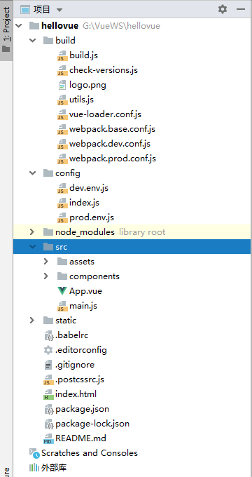

### 安装nodejs,搭建Vue环境

```txt
1.下载node.js的msi在线安装文件，然后一路next安装完成（期间遇到问题，通过右键msi文件选择管理员授权解决） http://nodejs.cn/download/
2.新建nodejs缓存和全局文件夹，在安装目录C:\Program Files\nodejs下面新建node_global和node_cache两个文件夹,然后cmd执行命令：
    npm config set cache "C:\Program Files\nodejs\node_cache"
    npm config set prefix "C:\Program Files\nodejs\node_global"   
3.配置nodejs环境变量
   用户变量  修改PATH为  C:\Program Files\nodejs\node_global
   系统变量  新建NODE_PATH 为  C:\Program Files\nodejs
   系统变量  修改Path，在原先nodejs路径后面修改为  C:\Program Files\nodejs\;C:\Program Files\nodejs\node_modules
4.安装基于nodejs的淘宝镜像
    重点使用管理员权限打开cmd,执行以下命令，配置镜像站是为了安装快速+安装cnpm
    npm install -g cnpm --registry=https://registry.npm.taobao.org
5.安装vue和vue脚手架
    cnpm install vue -g
    cnpm install vue-cli -g
    
    如出现'cnpm' 不是内部或外部命令,也不是可运行的程序，是没有配置环境变量的 path 
    
新建Vue项目   
#创建一个基于webpack模板的新项目
新建一个文件夹nodeone
cmd 进入创建的文件夹 cd /d d:\nodeworkspace\nodeone
vue init webpack nodeone
期间会有很多反馈，按照提示回车就可以了，安装下载文件
# 切换至项目路径
cd d:\nodeworkspace\nodeone
# 安装项目依赖文件
cnpm install
# 项目启动
cnpm run dev 


```

### NVM+node,搭建Vue环境

```
1.下载NVM并安装 https://github.com/coreybutler/nvm-windows/releases，注意2个目录，前者是NVM安装目录，后者是node安装目录，目录不要有空格或者汉字，否则会出现错误，打开时以管理员身份
2.安装node版本并设置镜像，系统会自动下载npm
   node_mirror: https://npm.taobao.org/mirrors/node/
   npm_mirror: https://npm.taobao.org/mirrors/npm/
 3.安装完成后，可以看环境变量都已经自动设置成功
 4.重点使用管理员权限打开cmd,执行以下命令，配置镜像站是为了安装cnpm
    npm install -g cnpm --registry=https://registry.npm.taobao.org
    出现'cnpm' 不是内部或外部命令,也不是可运行的程序，是没有配置环境变量的 path 
    环境变量中配置path路径 K:\Program Files\nodejs\node_global
5.安装脚手架 cnpm install -g @vue/cli
6.新建工作区间，后在命令界面进入
  vue init webpack nodeone
  ** 说明：**
Project name：项目名称，默认 回车 即可
Project description：项目描述，默认 回车 即可
Author：项目作者，默认 回车 即可
Install vue-router：是否安装 vue-router，选择 n 不安装（后期需要再手动添加）
Use ESLint to lint your code：是否使用 ESLint 做代码检查，选择 n 不安装（后期需要再手动添加）
Set up unit tests：单元测试相关，选择 n 不安装（后期需要再手动添加）
Setup e2e tests with Nightwatch：单元测试相关，选择 n 不安装（后期需要再手动添加）
Should we run npm install for you after the project has been created：创建完成后直接初始化，选择 n，我们手动执行
7.初始化并运行
  cd myvue //项目名称
  npm install    //一定要安装，否则编译会出现错误
  npm run dev
  可以在http://localhost:8080 看到界面
8.用IDE打开设置就可以运行了
```



```
9.主目录
文件夹：
  build -- webpack相关配置文件，一般情况下不需要自己配置
  config -- vue基本配置文件，可配置端口号，打包输出等
  node_modules -- 依赖包，也就是运行cnpm install 安装的依赖组件都在这里
  src -- 项目核心文件，自己写的代码基本都放在这里面
  static -- 静态资源，一般图片类资源都放在这里
文件：
  .babelrc -- babel编译参数，不清楚干啥用的，还没学到呢，学到后补充知识
  .editorconfig -- 代码格式
  .gitignore -- git上传需要忽略的文件配置
  .postcssrc.js -- 转换css的工具
  index.html -- 主页
  package.json -- 项目基本信息及项目依赖关系
  README.md -- 项目说明
  
10. build目录
   build.js -- 生成环境构建
   check-versions.js -- 版本检查（node,npm)
   logo.png -- vue的logo图片
   utils.js -- 构建用相关工具
   vue-loader.conf.js -- css加载器配置
   webpack.base.conf.js -- webpack基础配置
   webpack.dev.conf.js -- webpack开发环境配置
   webpack.prod.conf.js -- webpack生产环境配置

11.config目录
   dev.env.js -- 开发环境配置
   index.js -- 项目主要配置，监听端口，打包路径等
   prod.env.js -- 生产环境配置
   
12.src目录
   assets文件夹 -- 放置静态资源，css，less，lass等样式文件，外部js文件等，也可以放置图片，文档等静态资源
   components文件夹 -- 公共组件
   router文件夹 -- 路由，配置项目路由
   App.vue -- 根组件
   main.js -- 入口文件
   
 13.nvm命令
 	nvm ls 查看已经安装的所有nodejs版本
	nvm install 版本号，可安装指定版本的nodejs
	nvm use 版本号，即可切换到指定版本
	nvm uninstall 版本号，卸载指定版本
	nvm list 查看nodejs版本列表
 
```

### json-server 模拟数据

```
1. 先安装
	npm install json-server -g
2.查看是否安装成功
	json-server -h
3.任意新建一个文件夹 mock，cd mock，在mock下 新建test.json，准备数据
4.在mock下执行 -p是指定端口，默认是300
   	json-server -w test.json -p 8001
```

### 安装Vue Devtools调试工具 

```
1.极简插件直接搜索下载，安装
2.Vue.js not detected解决方案和图标没有亮的问题
	勾选 “允许访问文件URL”
	打开我的电脑，找到如下位置 		K:\Users\PC\AppData\Local\ChromeCore\UserData\Default\Extensions\hjccockbjjdckanpgpncmegnklpijbho\4.1.4_0
	打开文件manifest.json
	{
   "background": {
      "persistent": false,
      "scripts": [ "build/background.js" ]
   },
	false修改成true保存即可,
3.使用chrome浏览器打开一个vue项目，图标变绿或者打开开发者模式看见Vue
```

