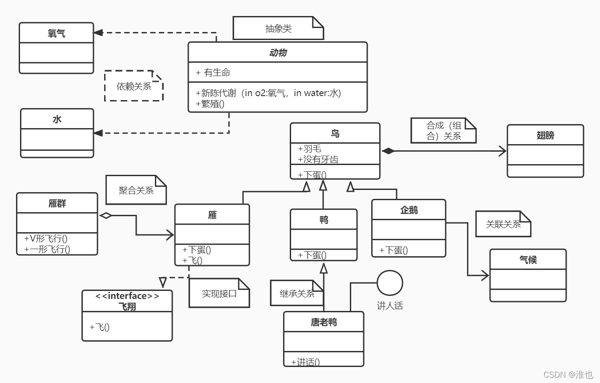

#### 设计模式分类

创建型：5；  单例、抽象工厂、建造者、工厂、原型

结构性：7；  适配器、桥接、装饰、组合、外观、享元、代理

行为型：11； 模板方法、命令、迭代器、观察者、中介者、备忘录、解释器、状态、策略、职责链、访问

例外：并发型模式和线程池模式 

#### 设计6大原则

 开闭原则：对扩展开放、对修改封闭

 单一职责：不要存在多于一个导致类变更的原因，也就是说每个类应该实现单一的职责，否则就应该把类拆分。

 里氏替换原则（Liskov Substitution Principle）： 任何基类可以出现的地方，子类一定可以出现。里氏替换原则是继承复用的基石，只有当衍生类可以替换基类，软件单位的功能不受到影响时，基类才能真正被复用，而衍生类也能够在基类的基础上增加新的行为。
里氏代换原则是对“开-闭”原则的补充。实现“开闭”原则的关键步骤就是抽象化。而基类与子类的继承关系就是抽象化的具体实现，所以里氏代换原则是对实现抽象化的具体步骤的规范。里氏替换原则中，子类对父类的方法尽量不要重写和重载。因为父类代表了定义好的结构，通过这个规范的接口与外界交互，子类不应该随便破坏它。

 依赖倒转原则（Dependence Inversion Principle）：面向接口编程，依赖于抽象而不依赖于具体。写代码时用到具体类时，不与具体类交互，而与具体类的上层接口交互。

接口隔离原则（Interface Segregation Principle）：每个接口中不存在子类用不到却必须实现的方法，如果不然，就要将接口拆分。使用多个隔离的接口，比使用单个接口（多个接口方法集合到一个的接口）要好。

迪米特法则（最少知道原则）（Demeter Principle）：一个类对自己依赖的类知道的越少越好。无论被依赖的类多么复杂，都应该将逻辑封装在方法的内部，通过public方法提供给外部。这样当被依赖的类变化时，才能最小的影响该类。
最少知道原则的另一个表达方式是：只与直接的朋友通信。类之间只要有耦合关系，就叫朋友关系。耦合分为依赖、关联、聚合、组合等。我们称出现为成员变量、方法参数、方法返回值中的类为直接朋友。局部变量、临时变量则不是直接的朋友。我们要求陌生的类不要作为局部变量出现在类中。

合成复用原则（Composite Reuse Principle）：尽量首先使用合成/聚合的方式，而不是使用继承。

#### UML

##### 类间的关系

6种关系； 强弱顺序： 泛化 = 实现 > 组合 > 聚合 > 关联 > 依赖。

泛化关系(Generalization)：可以理解为继承，父类与子类之间，由子类指向父类；实线+三角

实现关系(Realization)：接口与实现类之间，由实现类指向接口 ，特殊的；虚线+三角

组合(Composition)：整体与部分的关系，整体对象销毁时成员对象一并销毁，一般在构造函数中创建成员对象。constain -a，整体失去，个体也失去意义。

聚合(Aggregation)：整体与部分的关系，整体对象销毁时成员对象不销毁，一般是构造函数或Set方法传入成员对象。has -a,各部分相对独立。

关联(Association)：双向关联，单向关联，自关联、多重性关联Multiplicity、实线箭头————>

依赖关系(Dependency)：Driver类依赖Car类的move方法，Driver--->Car，体现为返回值，参数，局部变量和静态方法的调用，是最弱的

##### 用例间关系

4种；关联、泛化、包含、扩展

准确的说只有3种：即泛化、包含include、扩展extend

泛化可以理解为继承，指向父用例

包含include可以理解为分解，即大用例分解成不同的部分用例，指向分解出来的功能用例，或者用例需要做的步骤或者前提

扩展extend是功能的延伸，相当于为基础用例提供一个附加功能。

●泛化侧重表示子用例间的互斥性；

 ●包含侧重表示被包含用例对Actor提供服务的间接性；

●扩展侧重表示扩展用例的触发不定性；

### 设计模式简析

创建型：主要用于创建对象，为类实例化对象提供指南

结构型：主要用于处理类或对象的组合以获取更大的结构

行为型：用于描述类或对象的交互和职责分配，为类间交互和分配职责方式提供指南。

#### 创建型模式

有：抽象工厂，工厂方法，单例，原型，构建器5种；特点是对象的使用与创建分离，使用者不需关注对象的创建细节。

单例：一个类只有一个实例

原型：一个对象作为原型通过复制克隆出多个类似的新实例

工厂模式分3种：简单工厂，工厂方法，抽象工厂

简单工厂有创建实例的静态方法，生成不同的产品。但每增加产品就要增加具体产品类和修改工厂类

工厂方法则在简单工厂上进一步抽象化，将工厂类进一步抽象为创建产品的接口，由子类工厂决定生产什么产品

抽象工厂是对工厂方法的升级，由只能生产一级的产品变为可以生产多等级的产品，是提供了创建产品族的接口，每个子类工厂可以生产一系列相关的产品，但增加产品时每个工厂类都要修改

建造者：有部分和整体聚合的关系，复杂对象分解成多个相对简单的部分，然后根据不同需要分别创建它们，最后构建成该复杂对象，Builder传入Director方法组装

#### 结构性模式

有：代理，适配器，桥接，装饰，外观，享元，组合7种；特点是采用继承组织接口和类，组合或 聚合组合对象实现更大的结构

外观：为子系统对外提供一个共同的层或者方法以供调用

代理：中介和保护的作用以控制对象的访问，其中realSubject和proxy均是Subject的实现

适配器：将一个类的接口转换成客户希望的另外一个接口，使得原本由于接口不兼容而不能一起工作的那些类能一起工作。Adapter实现Target接口从而能够与Adaptee一起工作

桥接：抽象与实现分离，使它们可以独立变化；将变化抽象提取独立出来，Implementor通过实现，Abstraction通过继承进行扩展；使得各自能够独立变化，桥接类使2个变化连接结合。

装饰：不改变结构的前提下，动态的增加职责扩展功能；ConcreteComponent和Decorator均实现于Component，ConcreteDecorator实现于Decorator用于增加

享元：共享来大幅度减少对象创建等开销以提高资源利用率；UnsharedConcreteFlyweight依赖于Flyweight 并存储着非共享的信息，ConcreteFlyweight通过变化实现Flyweight ，FlyweightFactory通过关键字 key 来管理具体享元，从而被调用

组合：将对象组合成树状层次结构，使用户对单个对象和组合对象具有一致的访问性。Component作为公共接口，Leaf实现Component，Composite继承实现和管理聚合Component

均是特点结构型，外观是层，组合是树，装饰是图，桥接是桥，代理是虚拟，享元是共享，适配器是统一

#### 行为型模式

有模板方法，策略 ，命令，职责链，状态，观察者，中介者，迭代器，访问者，备忘录，解释器11种；是描述类或对象间的交互和职责分配，协同完成任务，涉及算法和流程控制。

模板方法:定义一个操作中的算法骨架,部分步骤延迟到子类中，从而不改变算法结构的情况下重定义算法步骤；Abstract Class定义骨架，Concrete Class实现或者重写部分Abstract Class方法

策略：不同的算法封装以供相互替换调用；Strategy定义了一个公共接口，ConcreteStrategy实现Strategy的算法实现，Context类聚合Strategy以供调用

命令：将一个请求封装为一个对象，是请求与执行分割，通过命令对象沟通；Command执行接口，Concrete Command实现Command并聚合Receiver，Command聚合于Invoker发送请求，以供调用

职责链：

### 架构设计风格

架构设计核心是能否使用重复的软件架构模式，达到架构级别的重用。架构风格是描述某一特定应用领域中系统组织方式的惯用模式；定义了一个系统家族（一组约束和一个词汇表），反应了共有的结构和语义特性。

架构风格的四要素：一个词汇表，一套配置规则，一套语义解释原则和基于这种风格系统的分析。

数据流风格：批处理序列；管道/过滤器

调用/返回风格：主程序/子程序，面向对象，层次结构

独立构件风格：进程通信；事件驱动系统

虚拟机风格：解释器，基于规则系统

仓库风格：数据库系统，超文本系统，黑板系统

经典的层次结构：C/S，B/S，MVC，MVP 

### 软件架构评估

质量属性：性能，可靠性，可用性，安全性，可修改性，功能性，可变性，互操作性8个

敏感点：为实现某种特定的质量属性，一个或者多个构建的特性；权衡点:影响多个质量属性的特性，是多个质量属性的敏感点。

风险点与非风险点：潜在的存在问题的架构决策所带来的隐患

基于场景的评估方式：架构权衡分析法，成本效益分析法，软件架构分析法

软件需求包括功能需求、非功能需求和设计约束三方面内容

结构化分析工具：数据流图，数据字典，结构化语言，判定表，判定树

表示系统静态结构的静态模型（包括类图、对象图、包图、构件图、部署图、制品图），以及表示系统动态结构的动态模型（包括对象图、用例图、顺序图、通信图、定时图、状态图、活动图、交互概览图）